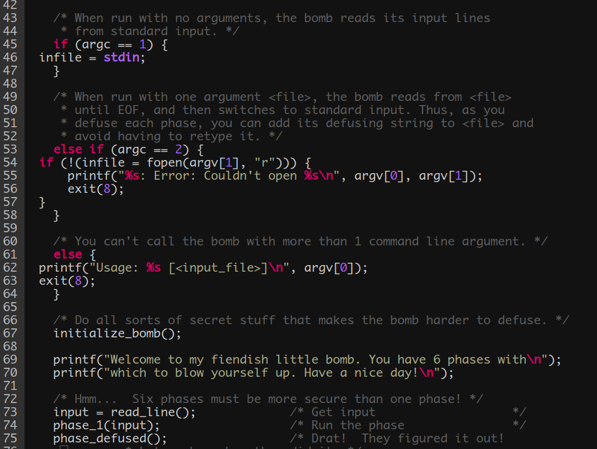
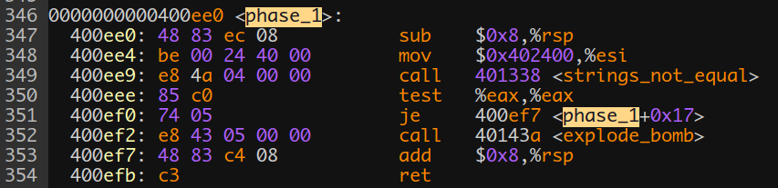
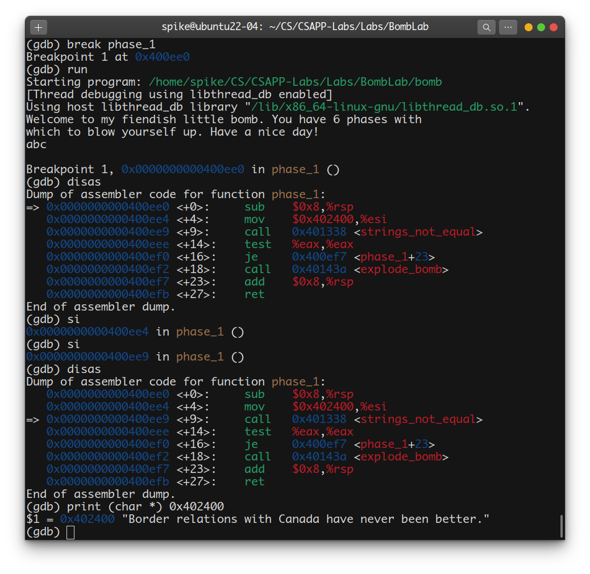
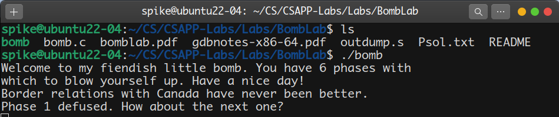
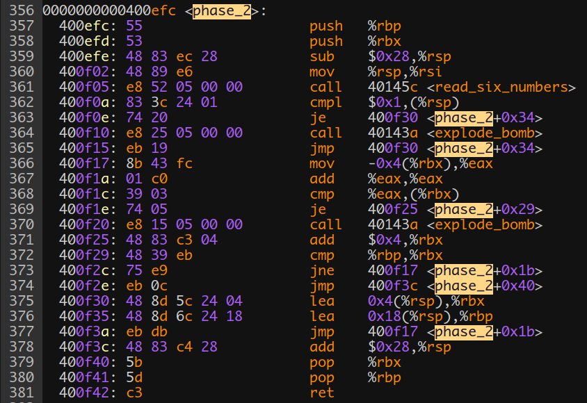
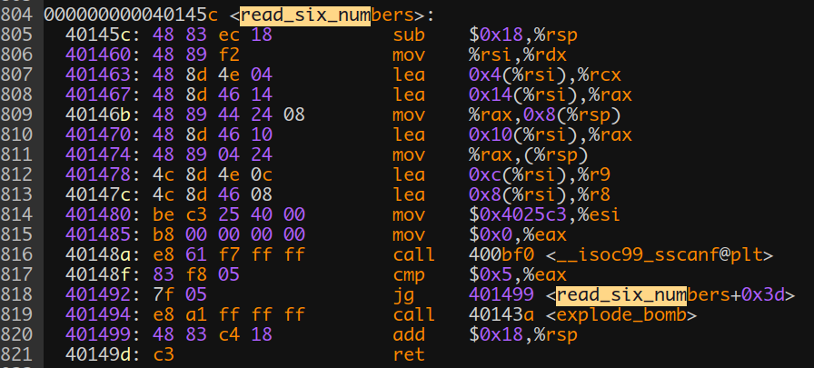
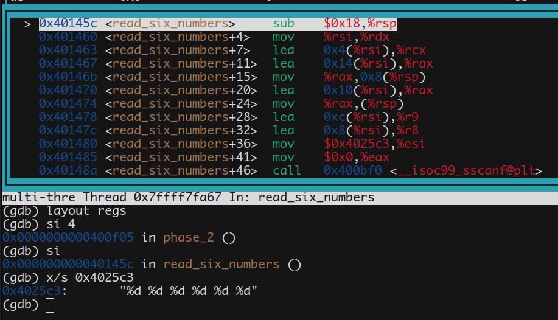
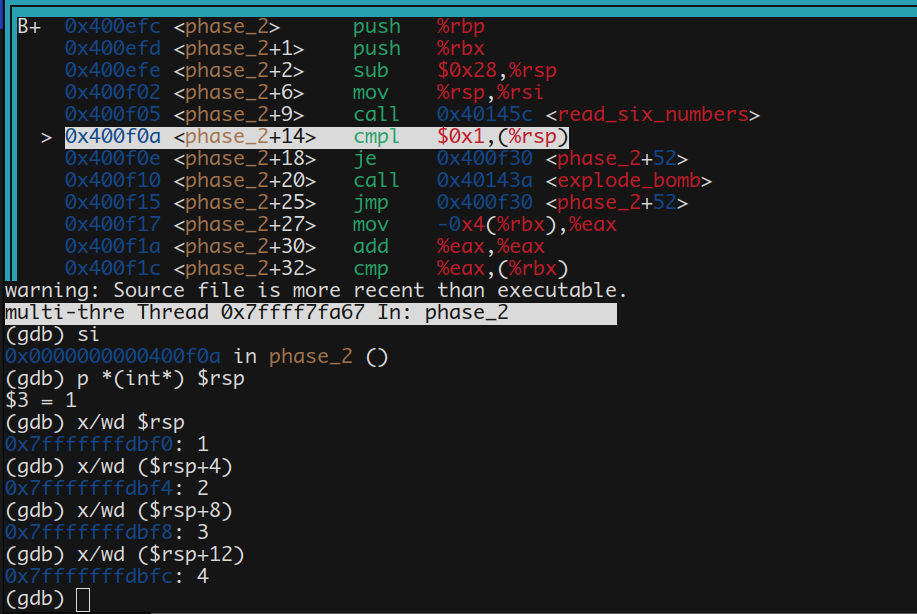
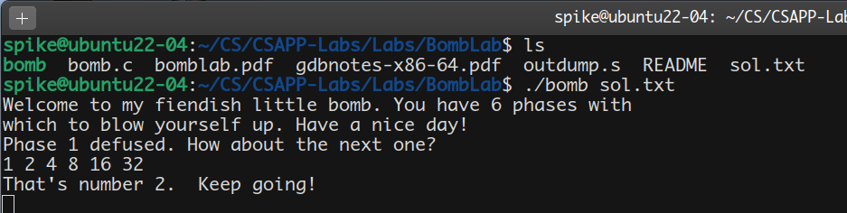

# Bomb Lab

`bomb.tar`中提供了如下文件:

- `bomb` (二进制可执行文件)
- `bomb.c` (bomb的C程序文件)
- `README`

尝试直接运行可执行文件`./pic/bomb`，结果直接就炸了，还是从C程序文件读起吧。



从`bomb.c`中可以看出:
- 如果`argc == 1`，即只在终端中输入`./pic/bomb`时，需要在程序运行时以标准输入形式按行读入字符串；
- 否则如果`argc == 2`，即可通过文件名打开文件按行读入字符串；
- 总共有6个阶段，每个阶段命名为: `phase_x, x = 1 ~ 6`；

为了方便查看汇编代码，使用`objdump`获得反汇编文件:

```bash
objdump -d bomb > outdump.s
```

### phase_1



这段汇编逻辑很简单:

栈上开辟空间后，将`$0x402400`传入`%esi`，随后调用函数`<string_not_equal>`。从字面意思来看应该就是判断我们输入的字符串和答案字符串是否相等。

最后检查返回值`%eax`是否为0，为0则退栈，不为0则调用函数`<explode_bomb>`。

上面传入`%esi`寄存器的应该是一个地址，那么在`gdb`中查看一下这个地址所存储的字符串:



答案已经出来了: 

Border relations with Canada have never been better.

再运行`./pic/bomb`测试一下：



### phase_2



前4行汇编代码都是为进入`phase_2`函数做准备，在第5行进入函数`<read_six_numbers>`，那么就进入这个函数看看:



第805行:
```x86asm
sub $0x18, %rsp
```
这段代码含义为将栈指针`%rsp`向下移动`$0x18`个单位，即24B。很明显，这是在为栈上传递参数做准备。继续往下看，可以看出，从806-813行，均是在进行寄存器与栈上的传值，暂时看不出什么端倪。

但在814行有了些特殊的信息:
```x86asm
mov $0x4025c3, %esi
```
与`phase_1`一样，这儿也出现了一个类似于地址的值`0x4025c3`，借助于`phase_1`的经验，赶紧看看这个地址里存储了什么:



结合函数名称已经明白，此处是要输入6个整数，每个整数的类型为`int`，再结合805行的汇编语句，很明显此处开辟的栈空间为:
```
0x18 = 6 * 4B = 24B  
```
再结合815-817行，可知此时为调用库函数`scanf`进行6个整数的读入，`%eax`作为返回值，若`%eax > 5`，则退栈回到`<phase_2>`函数，否则调用`<explode_bomb>`函数引爆炸弹。

此时回到`phase_2`，随便输入6个整数:1 2 3 4 5 6，在执行完`<read_six_numbers>`函数后，查看一下栈上6个数字的存储情况:



此处已经完成了我们输入的6个整数的存储，其存储地址分别为

```x86asm
%rsp, %rsp+4, ... , %rsp+20
```
再回到`phase_2`，梳理从第362-368行的汇编语句可以写出如下对应的伪代码:
```c
0000000000400efc <phase_2>:
...
400f0a: 83 3c 24 01    cmpl   $0x1,(%rsp)
if(stack[%rsp] == 1)

400f0e: 74 20          je  400f30<phase_2+0x34>
jump to:
	0x400f30;

400f10: e8 25 05 00 00 call 40143a<explode_bomb>
400f15: eb 19          jmp  400f30<phase_2+0x34>

400f17: 8b 43 fc       mov    -0x4(%rbx),%eax
%eax = stack[%rbx - 4];

400f1a: 01 c0          add    %eax,%eax
%eax += %eax;

400f1c: 39 03          cmp    %eax,(%rbx)
if(%eax == stack[%rbx])

400f1e: 74 05          je   400f25<phase_2+0x29>
jump to:
	0x400f25;
	
400f20: e8 15 05 00 00 call 40143a<explode_bomb>
400f25: 48 83 c3 04    add    $0x4,%rbx
%rbx += 4;		./pic// 继续往上比较输入的数字

400f29: 48 39 eb       cmp    %rbp,%rbx
400f2c: 75 e9          jne  400f17<phase_2+0x1b>
400f2e: eb 0c          jmp  400f3c<phase_2+0x40>
if((%rbp - %rbx) != 0)
	jump to:
		0x400f17;
return;

400f30: 48 8d 5c 24 04 lea    0x4(%rsp),%rbx
%rbx = %rsp + 4;./pic//(此处存储输入的第2个数字)

400f35: 48 8d 6c 24 18 lea    0x18(%rsp),%rbp
%rbp = %rsp + 0x18;./pic//(循环结束的边界地址)

400f3a: eb db          jmp  400f17<phase_2+0x1b>
jump to:
	0x400f17
...
```
可以看出，这段代码是在进行这样的一段逻辑:

最开始判断存储的第1个数字`(%rsp)`是不是1，如果不是1，直接引爆炸弹。如果是1，则往下依次比较存储的6个数字。在比较过程中，`%eax`从1开始进行自加，实际上`%eax`在每次比较过程中的值即为:
```
1 2 4 8 16 32
```
所以，可以得出`phase_2`的答案的6个数字为:

1 2 4 8 16 32

进行验证:



