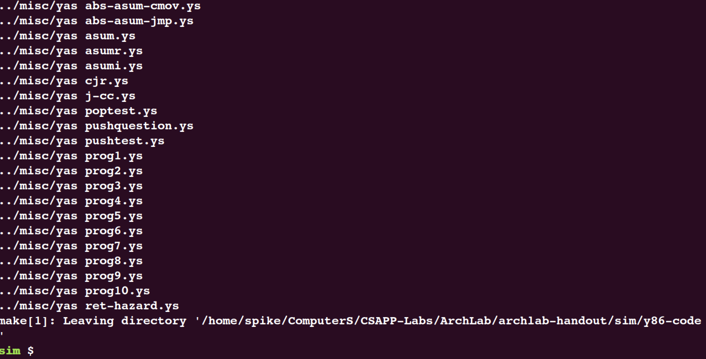
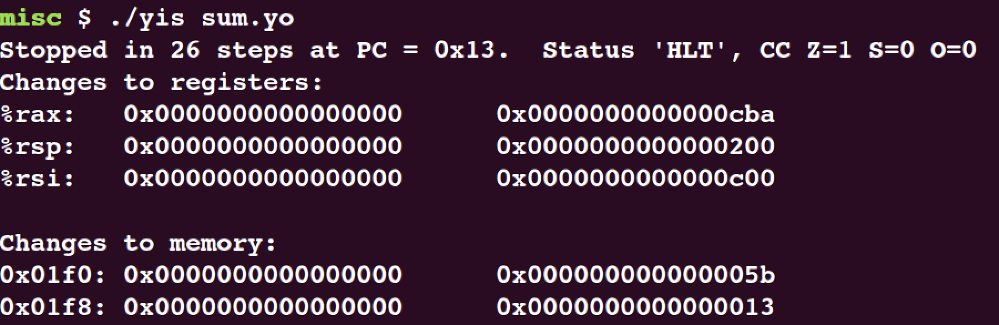

# Architechture Lab

按照hand out上面的说明，首先要对实验项目进行构建。可能会遇到相关工具没有预安装的问题，对于我这台机器(ubuntu18.04)来说是: flex / bison / tk-dev / tcl-dev，执行以下命令:

```bash
sudo apt-get update
sudo apt-get install flex bison tk-dev tcl-dev
```
安装完成之后再执行`make`，编译成功:



### Part A

该部分有三个子任务，要求实现对C代码向y86-64代码的重写。
- `sum.ys`: 实现链表元素的求和。

```c
/* linked list element */
typedef struct ELE {
long val;
struct ELE *next;
} *list_ptr;

/* sum_list - Sum the elements of a linked list */
long sum_list(list_ptr ls)
{
	long val = 0;
	while (ls) {
		val += ls->val;
		ls = ls->next;
	}
	return val;
}
```

对于`y86-64`代码的书写需要遵守其通用规则，具体可以查看`./sim/y86-code/`文件夹中的`*.ys`文件，同时也可以翻阅《CSAPP》教材第4章。

此处给出具体实现:

```x86asm
# Execution begins at address 0
	.pos 0
	irmovq	stack, %rsp		# Set up stack pointer
	call main							# Execution main progrem
	halt									# Terminate program

# Array of link list
	.align8
	ele1:
			.quad 0x00a
			.quad ele2
	ele2:
			.quad 0x0b0
			.quad ele3
	ele3:
			.quad 0xc00
			.quad 0

main:
	irmovq ele1, %rdi
	call sum_list					# sum_list(list_ptr ls)
	ret

# sum_list(list_ptr ls)
# ls in %rdi
sum_list:
	irmovq $0, %rax				# Initial retrun value 0
	jmp test							# check 
loop:
	mrmovq (%rdi), %rsi		# add link node value to return value
	addq %rsi, %rax
	mrmovq 8(%rdi), %rdi	# move link to next node 
test:
	andq %rdi, %rdi				# check if pointer == NULL
	jne loop							# if pointer != NULL, continue to loop
	ret

# Stack starts here and grows to lower address
	.pos 0x200
stack:
```

使用实验文件给出的`yas`汇编器、`yis`指令级模拟器进行测试:

```bash
./yas sum.ys
./yis sum.yo
```

结果正确:

