# Bomb Lab

`bomb.tar`中提供了如下文件:

- `bomb` (二进制可执行文件)
- `bomb.c` (bomb的C程序文件)
- `README`

尝试直接运行可执行文件`./bomb`，结果直接就炸了，还是从C程序文件读起吧。

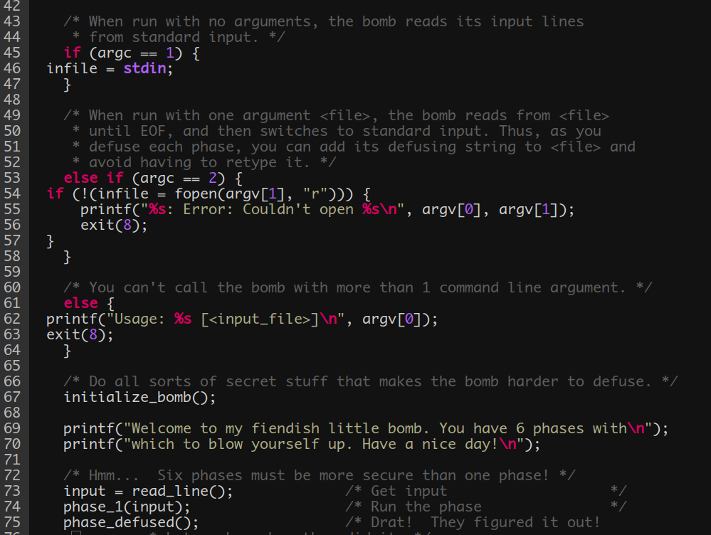

从`bomb.c`中可以看出:
- 如果`argc == 1`，即只在终端中输入`./bomb`时，需要在程序运行时以标准输入形式按行读入字符串；
- 否则如果`argc == 2`，即可通过文件名打开文件按行读入字符串；
- 总共有6个阶段，每个阶段命名为: `phase_x, x = 1 ~ 6`；

为了方便查看汇编代码，使用`objdump`获得反汇编文件:

```bash
objdump -d bomb > outdump.s
```

### phase_1

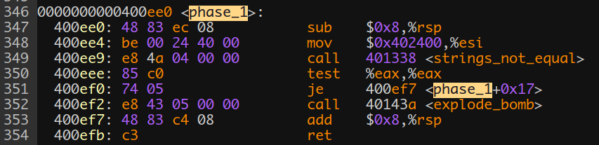

这段汇编逻辑很简单:

栈上开辟空间后，将`$0x402400`传入`%esi`，随后调用函数`<string_not_equal>`。从字面意思来看应该就是判断我们输入的字符串和答案字符串是否相等。

最后检查返回值`%eax`是否为0，为0则退栈，不为0则调用函数`<explode_bomb>`。

上面传入`%esi`寄存器的应该是一个地址，那么在`gdb`中查看一下这个地址所存储的字符串:

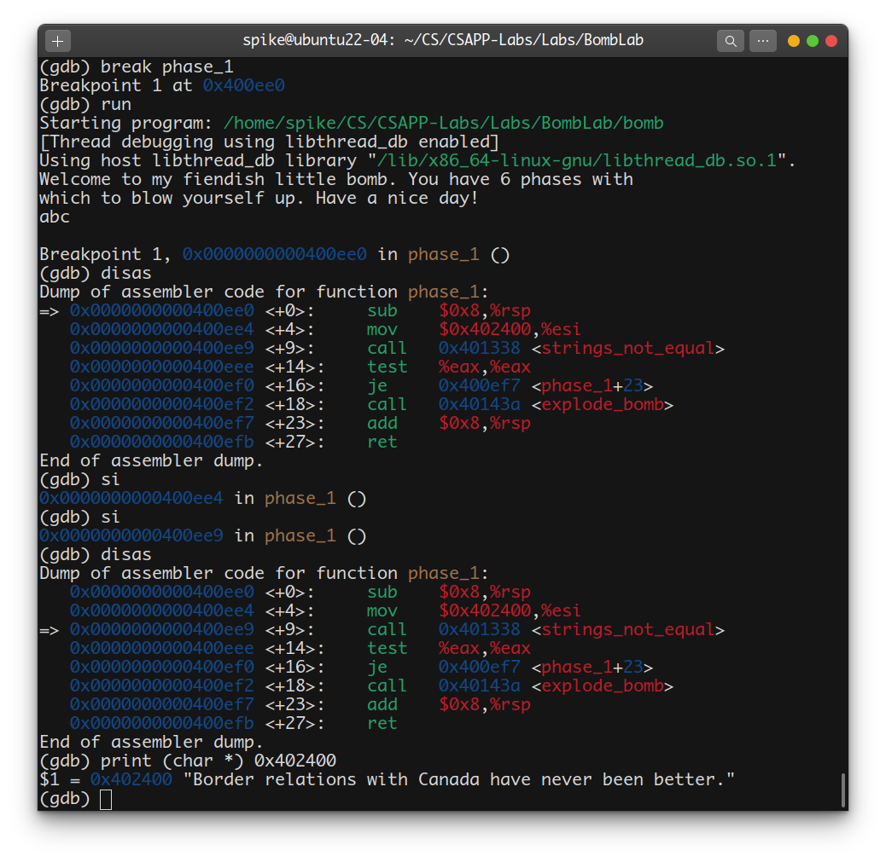

答案已经出来了: 

```
Border relations with Canada have never been better.
```

再运行`./bomb`测试一下：

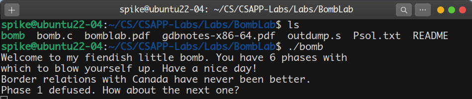

### phase_2

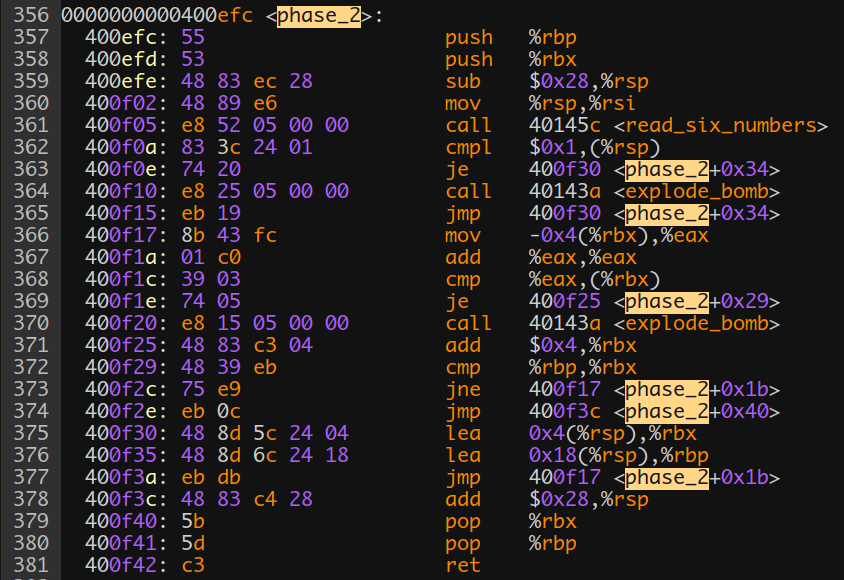

前4行汇编代码都是为进入`phase_2`函数做准备，在第5行进入函数`<read_six_numbers>`，那么就进入这个函数看看:

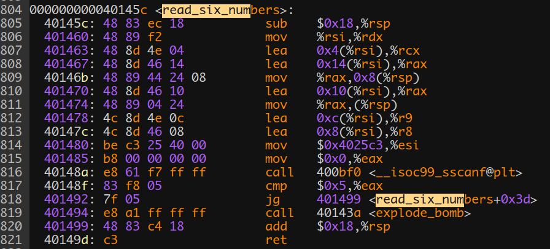

第805行:
```x86asm
sub $0x18, %rsp
```
这段代码含义为将栈指针`%rsp`向下移动`$0x18`个单位，即24B。很明显，这是在为栈上传递参数做准备。继续往下看，可以看出，从806-813行，均是在进行寄存器与栈上的传值，暂时看不出什么端倪。

但在814行有了些特殊的信息:
```x86asm
mov $0x4025c3, %esi
```
与`phase_1`一样，这儿也出现了一个类似于地址的值`0x4025c3`，借助于`phase_1`的经验，赶紧看看这个地址里存储了什么:

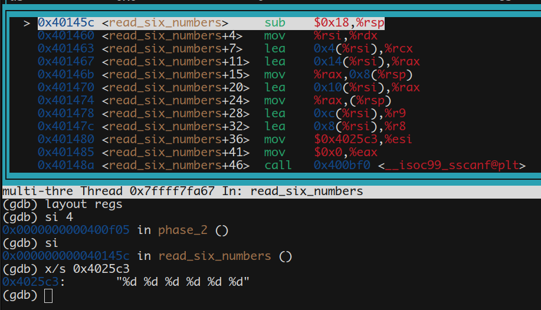

结合函数名称已经明白，此处是要输入6个整数，每个整数的类型为`int`，再结合805行的汇编语句，很明显此处开辟的栈空间为:
```
0x18 = 6 * 4B = 24B  
```
再结合815-817行，可知此时为调用库函数`scanf`进行6个整数的读入，`%eax`作为返回值，若`%eax > 5`，则退栈回到`<phase_2>`函数，否则调用`<explode_bomb>`函数引爆炸弹。

此时回到`phase_2`，随便输入6个整数:1 2 3 4 5 6，在执行完`<read_six_numbers>`函数后，查看一下栈上6个数字的存储情况:

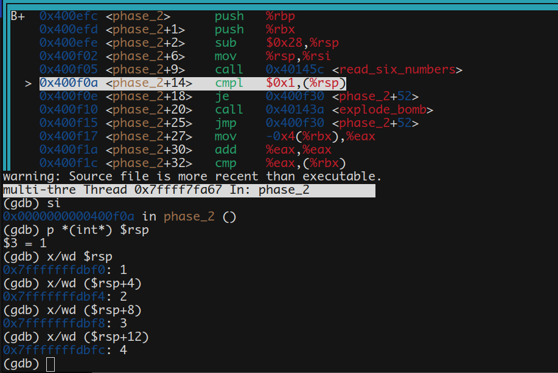

此处已经完成了我们输入的6个整数的存储，其存储地址分别为

```x86asm
%rsp, %rsp+4, ... , %rsp+20
```
再回到`phase_2`，梳理从第362-368行的汇编语句可以写出如下对应的伪代码:
```c
0000000000400efc <phase_2>:
...
400f0a: 83 3c 24 01    cmpl   $0x1,(%rsp)
if(stack[%rsp] == 1)

400f0e: 74 20          je  400f30<phase_2+0x34>
jump to:
	0x400f30;

400f10: e8 25 05 00 00 call 40143a<explode_bomb>
400f15: eb 19          jmp  400f30<phase_2+0x34>

400f17: 8b 43 fc       mov    -0x4(%rbx),%eax
%eax = stack[%rbx - 4];

400f1a: 01 c0          add    %eax,%eax
%eax += %eax;

400f1c: 39 03          cmp    %eax,(%rbx)
if(%eax == stack[%rbx])

400f1e: 74 05          je   400f25<phase_2+0x29>
jump to:
	0x400f25;
	
400f20: e8 15 05 00 00 call 40143a<explode_bomb>
400f25: 48 83 c3 04    add    $0x4,%rbx
%rbx += 4;				// 继续往上比较输入的数字

400f29: 48 39 eb       cmp    %rbp,%rbx
400f2c: 75 e9          jne  400f17<phase_2+0x1b>
400f2e: eb 0c          jmp  400f3c<phase_2+0x40>
if((%rbp - %rbx) != 0)
	jump to:
		0x400f17;
return;

400f30: 48 8d 5c 24 04 lea    0x4(%rsp),%rbx
%rbx = %rsp + 4;		//(此处存储输入的第2个数字)

400f35: 48 8d 6c 24 18 lea    0x18(%rsp),%rbp
%rbp = %rsp + 0x18;		//(循环结束的边界地址)

400f3a: eb db          jmp  400f17<phase_2+0x1b>
jump to:
	0x400f17
...
```
可以看出，这段代码是在进行这样的一段逻辑:

最开始判断存储的第1个数字`(%rsp)`是不是1，如果不是1，直接引爆炸弹。如果是1，则往下依次比较存储的6个数字。在比较过程中，`%eax`从1开始进行自加，实际上`%eax`在每次比较过程中的值即为:
```
1 2 4 8 16 32
```
所以，可以得出`phase_2`的答案的6个数字为:

1 2 4 8 16 32

进行验证:

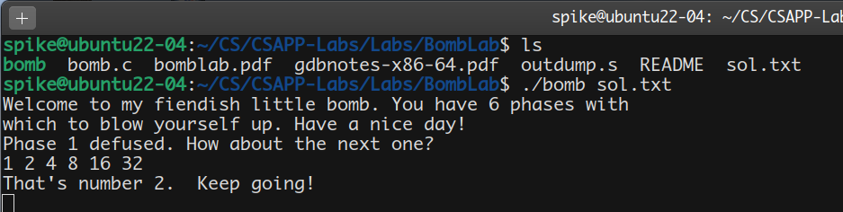

### phase_3

首先还是进入`phase_3`查看汇编代码：

-----图片-----

很明显容易注意到，385-386两行是将栈指针`%rsp+8`与`%rsp+12`分别赋值给了`%rcx`与`%rdx`，凭借在《CSAPP》中学到的知识，可以猜测应该是通过栈来传递参数，不过此时无法确定，还需往后继续阅读。

此时同样出现了一个神秘地址`0x4025cf`，与`phase_1`、`phase_2`一样，查看一下该地址的内容:

-----图片-----

发现是要求输入两个整数，这印证了我们之前的猜想。继续读代码，从390-418行这一段代码，看起来有些复杂，但拿笔在纸上按行模拟一下也不难理解其中逻辑:

-----图片-----

```x86asm
cmp		$0x1, %eax
jg		400f6a,	<phase_3+0x27>
call 	40143a	<explode_bomb>
```
我们知道`%eax`一般作为函数返回值，所以以上三行实际上就是在判断对于上一个函数调用`(scanf)`所读入的参数个数是否大于1(两个整数)，如果不大于1，就调用函数`<explode_bomb>`，否则跳转到`0x400f6a`处。

随后从393-418行的代码实际上是在进行如下的逻辑: 首先比较输入的第一个数字是否大于7，如果大于7则引爆炸弹，否则根据第一个数字的值，来选择应该比较的第二个参数的值，其中有一行代码值得注意:

```x86asm
...
jmp		*0x402470(, %rax, 8)
...
```
此处进行的是间接寻址，形式地址为`0x402470 + %rax * 8`，而真正的逻辑地址为`[0x402470 + %rax*8]`。分别尝试对`%rax`赋值0 - 7，获得的逻辑地址如图所示:

-----图片-----

可以看见逻辑地址均为393-414行中的代码地址一一对应，对于其中的
```
mov	$0x??, %eax
```
选择对应的0 - 7中的数字进行尝试，结果正确:

-----图片-----

所以`phase_3`总共有8组答案，每组两个数字:

-----图片-----

### phase_4

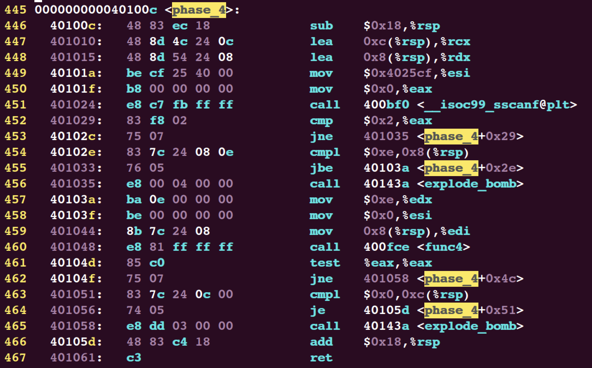

首先同之前的`phase_x`一样给出该阶段的汇编代码，可以看到449行一样出现了一个神秘地址`0x4025cf`，不用多说，直接打印该地址中存储的内容:

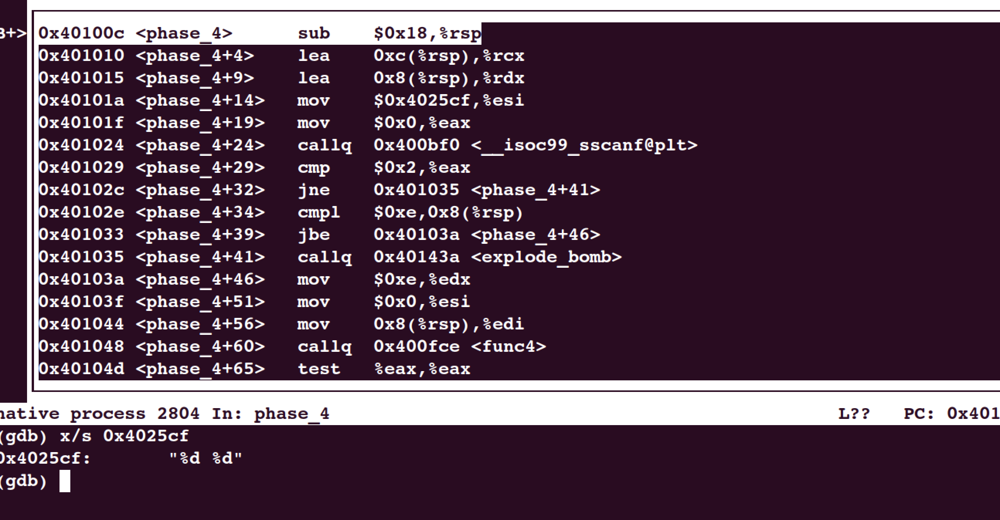

所以可以得知，该阶段是要求读入两个整数(从451-453行也可以知道，`%eax`作为返回值的寄存器，统计输入数字个数，如果不等于2就跳转到`<explode_bomb>`函数处)。继续读汇编代码，453行:

```x86asm
...
cmpl	$0xe,		0x8(%rsp)
jbe		40103a	<phase_4+0x2e>
call	40143a	<explode_bomb>
...
```

`0x8(%rsp)`处存储的是我们输入的第一个数字，从这三行代码可以得知，第一个输入的数字必须小于`0xe`，不然的话就会直接引爆炸弹。继续往下阅读，可以看到在初始化`%edx、%esi、%edi`后转入`<func4>`函数，进入`<func4>`继续阅读:

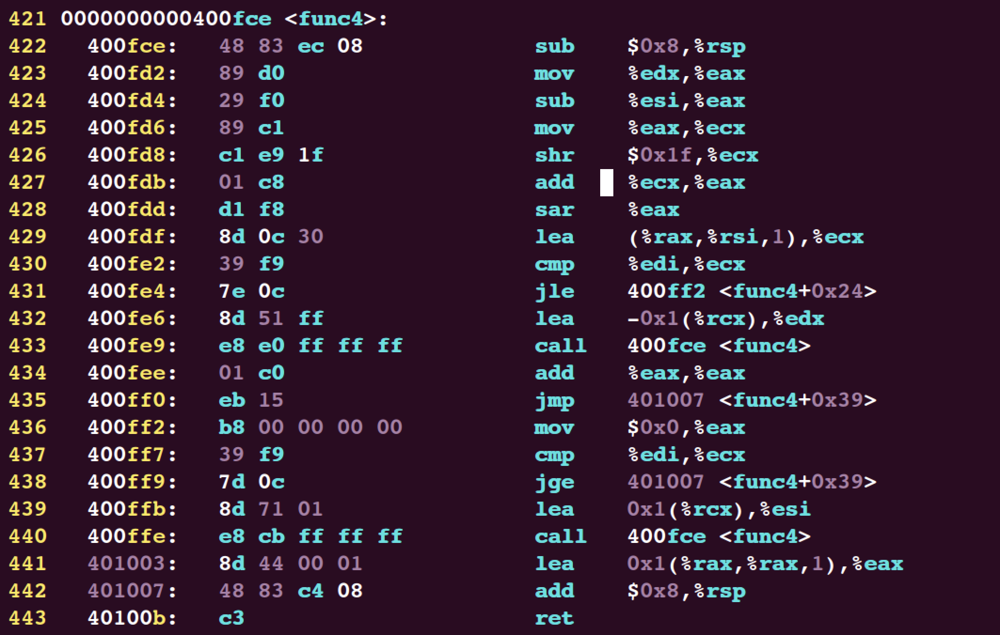

初步阅读之后可以发现这是一个结合了分支选择和递归调用的函数，单步执行观察寄存器值变化并不合适弄清楚这个函数的行为。于是考虑逆向获得该函数的类C代码，类C代码编写如下:

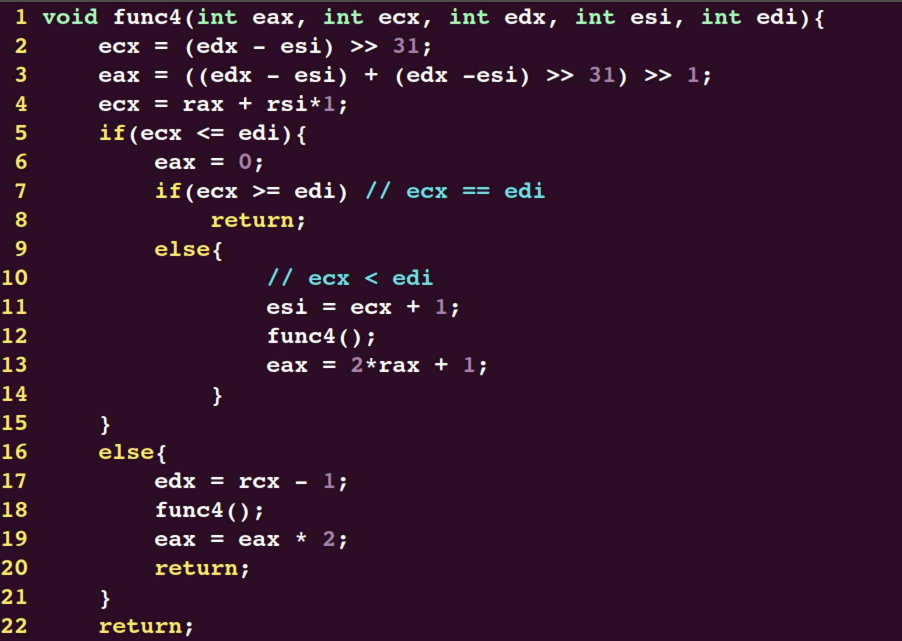

阅读该代码可以得知，控制函数行为起主要作用的是`%ecx、%edi`寄存器，而后者刚好就是我们输入的第一个参数。进入`<func4>`，执行2-4行代码后，`%edx`值变为7，所以此时有两种分支选择:

- 若`%edi > 7`: 会进入内层`else`，并且在最终退出递归时`%eax`值恒不等于0;
- 若`%edi <= 7`: 会进入内层`if`(当`%edi = 7`时直接return)，或进入外层`else`，此时会多次递归进入`<func4>`。经过模拟试验，在递归进入后想要跳出递归且保持`%eax = 0`，`%edi`的值需为:

```
7, 3, 1, 0
```

再结合`phase_4`中463-465行代码:

```x86asm
...
cmpl	$0x0,	0xc(%rsp)
je		40105d	<phase_4+0x51>
call	40143a	<explode_bomb>
...
```

可以得知，输入的第二个参数必须为0，否则会引爆炸弹。

选择一个数作为第一个参数运行`./bomb`:

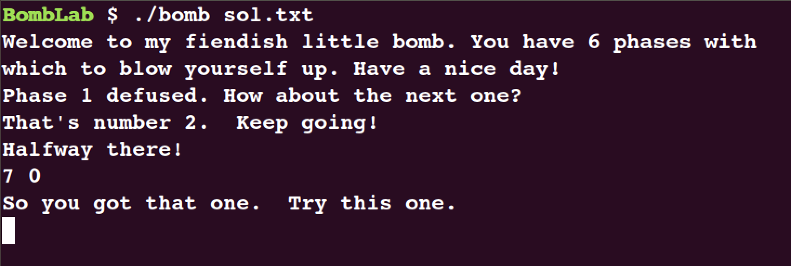

### phase_5

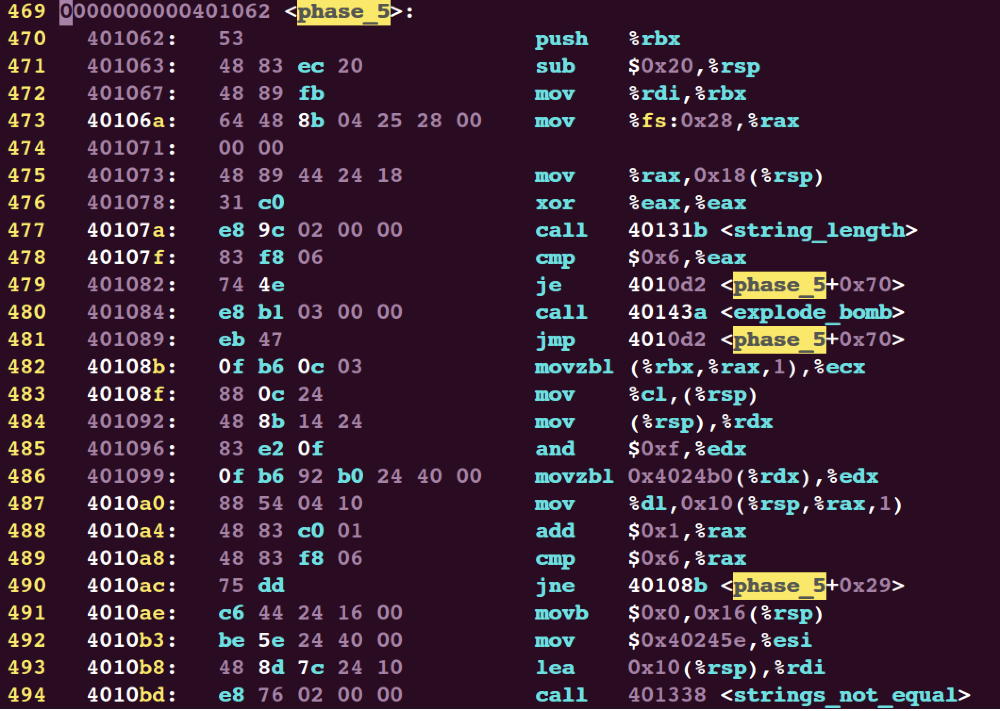
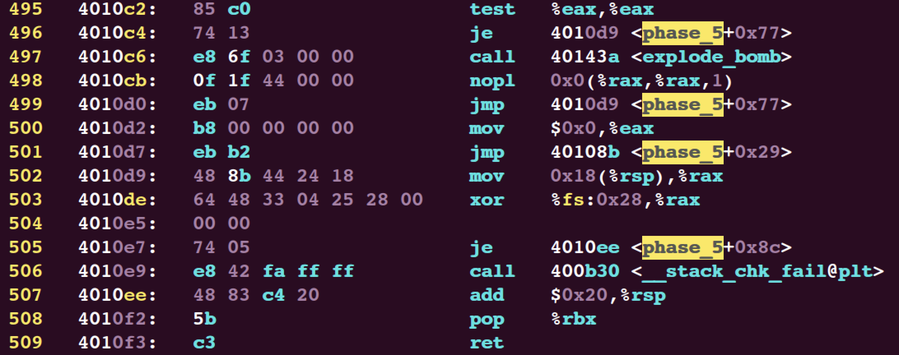

`phase_5`部分代码较长，比较合适的做法是先使用`gdb`单步执行指令，获得程序的大概执行过程后，逆向得出C程序代码再来理解。此处先不直接给出逆向最后的C代码，我们逐步来进行分析:

470-476行的代码是在进行“栈保护”，具体相关的知识可以从《CSAPP》第三章教材获得，该知识与本阶段要解决的问题关系不大，所以先不对这部分进行深究。

继续往后阅读，发现此时调用了函数`<string_length>`，由之前阶段可知，该函数用于统计输入中的字符个数，并且使用`%eax`寄存器作为返回值。返回的字符数要求为6，否则引爆炸弹。此处我们随意输入`123456`，继续往下执行。

经过两次地址跳转`0x4010d2 -> 0x40108b`后，`%eax`初始化为0，进入到482-490行的代码中:

```x86asm
...
movzbl	(%rbx, %rax, 1),	%ecx
mov			%cl,	(%rsp)
mov			(%rsp),	%rdx
and			$0xf,	%edx
movzbl	0x4024b0(%rdx),	%edx
mov			%dl,	0x10(%rsp, %rax, 1)
add			$0x1,	%rax
cmp			$0x6,	%rax
jne			40108b	<phase_5+0x29>
...
```

初步阅读可以知道，这是一个循环结构，以`%eax`作为循环跳出条件:
```
eax = 0;
while(eax != 6){
	...
	eax++;
}
```
此时我们的输入已经读入了程序，因为不清楚此时的寄存器值的情况，同时也确认一下我们的输入数据的存储位置，查看一下当前寄存器:

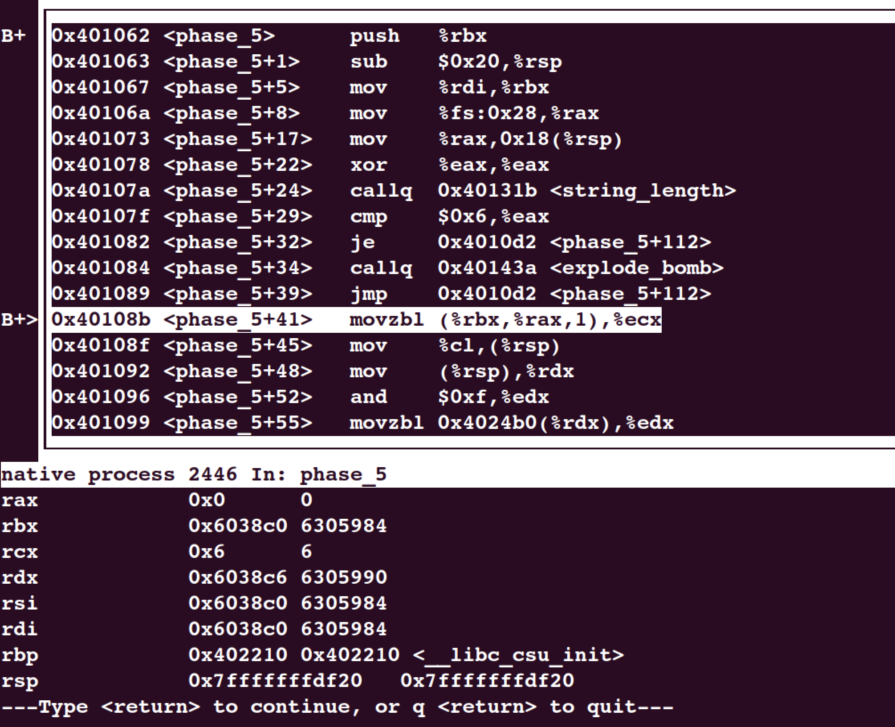

此时可以看见：
- `%eax`已经被初始化为0；
- `%rcx`值为6，应该是统计的是字符串中的字符个数；
- `%rbx = %rdi = %rsi = 0x6038c0`，这个值看起来没什么头绪，但是我们知道`%rdi`中存储的应该是我们的输入数据的相关信息；
- `%rdx = 0x6038c6 = 0x6038c0 + 6`，这个值看起来应该不是巧合，那么这个奇怪的数字必定与我们输入的数据有关。

进一步查看这几个寄存器相关信息:

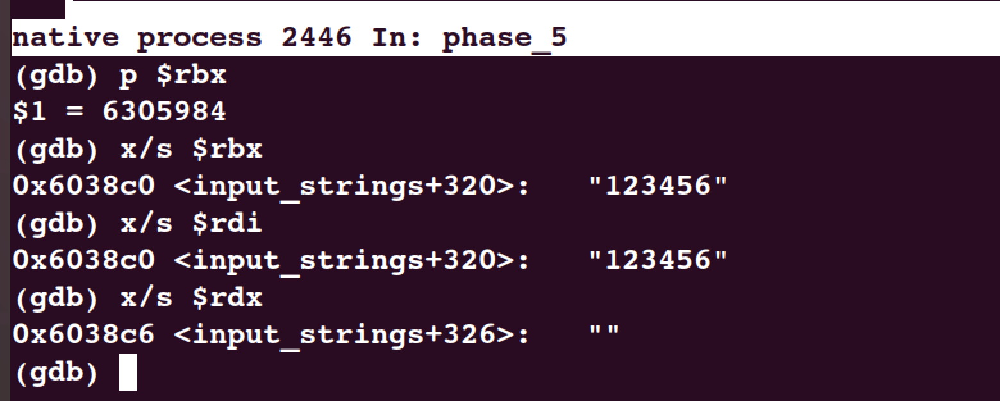

可以得知，`%rbx, %rdi, %rsi`中存储的是输入字符串的地址，`%rdx`是输入字符串的末尾地址。继续后续的代码阅读，从482-487行模拟执行后可以知道这段代码的大致逻辑如下:

当`%rax != 6`时:

- 以`%rax`作为变址寄存器，`%rbx`作为基地址(输入字符串的首地址)进行寻址，每次获得输入字符串其中的一个字符`c`，获取字符`c`的字节表示(只取低8位，高位取0)后，与`0xf`相与。

- 再将结果加上`0x4024b0`后进行间址寻址送`%edx`，再对`%edx`取低8比特，送到内存地址为`(%rsp + %rax * 1 + 0x10)`处存储。

- `%rax`自增1。

此处出现了一个地址`0x4024b0`，直接查看其中内容:

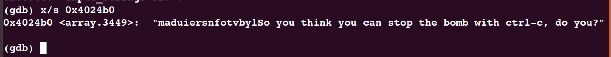

继续往下阅读，在执行完491-494行代码可以得知，此时`%rdi`中存储的应该是我们输入的字符串经过上述变换操作后寻址得到的字符串，而`%esi`中存储的应该是答案字符串，此时调用`<strings_not_equal>`函数进行对比，通过返回值`%eax`是否为0来决定最终是否引爆炸弹。

查看`%rdi`与`%esi`寄存器中内容：

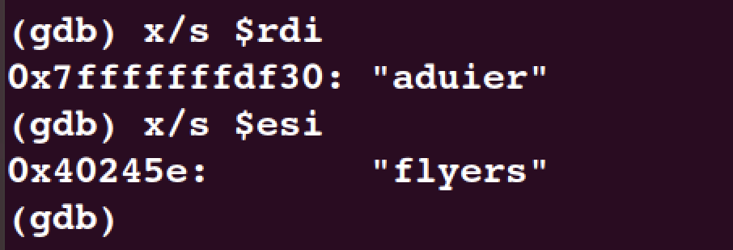

进行验证，对于字符`1`，其ASCII码的二进制表示为`0011_0001`，取低4比特后加上偏移地址`0x4024b0`后查看内容:

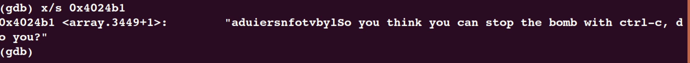

其第一个字符确实为`a`，且按照此规则，后续的字符也与输入字符串相匹配。所以答案已经明了:

输入6个字符，每个字符的ASCII码表示的低4比特加上偏移地址`0x4024b0`后对给定字符串进行寻址，要求最终寻址得到的字符串为:

```
flyers
```

简单计算后可得出一个答案:

```
9?>567
```

输入验证:

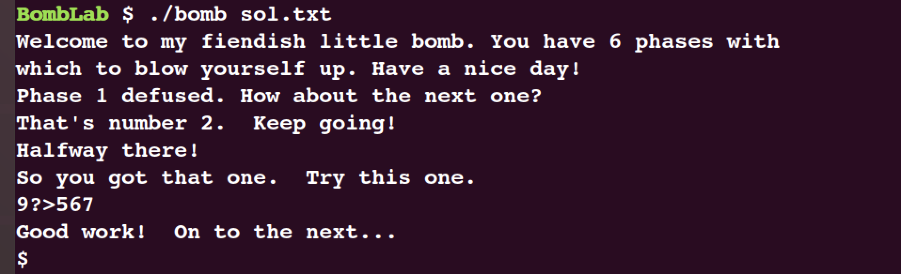


