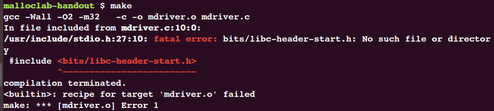
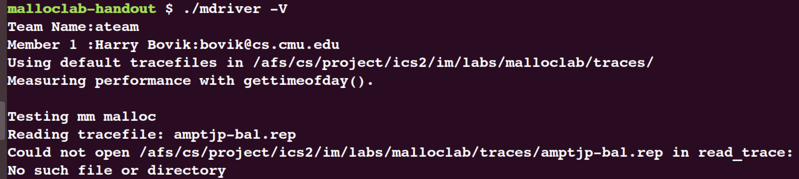
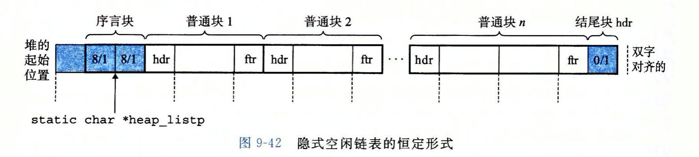
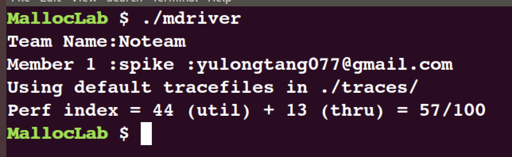
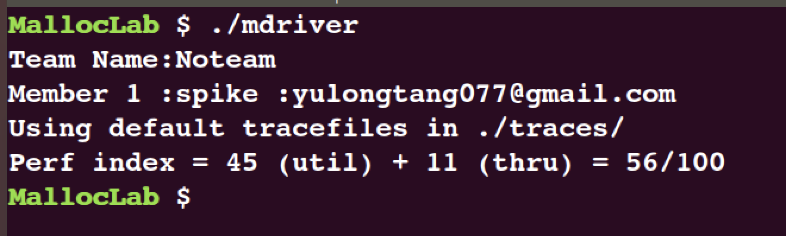

# MallocLab

## 实验准备

- 从官网下载的实验文件解压后直接`make`报错:



更新相关工具链后报错解决:

```bash
sudo apt-get update
sudo apt-get install build-essential
sudo apt-get install gcc-multilib g++-multilib
sudo apt-get install libc6-dev-i386
```

- 进行`make`后尝试执行测试程序报错:



原因是官方提供的文件里缺少相关的`traces`文件，并且我们需要在`config.h`与`Makefile`中修改相关的设置:

```c
// malloclab-handout/config.h
...

#define TRACEDIR "./traces/"

...
```

```makefile
// malloclab-handout/Makefile
...

VERSION = 1
# modify here
HANDINDIR = ./traces

# modify CC = gcc -> CC = gcc -g to use GDB
CC = gcc -g
# modify -O2 -> O0 to debug
CFLAGS = -Wall -O0 -m32

...

```

修改完成后进行测试:

```bash
./mdriver -V
```

若输出类似以下内容则表示测试成功:

```txt
Team Name:Noteam
Member 1 :spike :yulongtang077@gmail.com
Using default tracefiles in ./traces/
Measuring performance with gettimeofday().

Testing mm malloc
Reading tracefile: amptjp-bal.rep
Checking mm_malloc for correctness, efficiency, and performance.
Reading tracefile: cccp-bal.rep
Checking mm_malloc for correctness, efficiency, and performance.

......

Reading tracefile: realloc2-bal.rep
Checking mm_malloc for correctness, ERROR [trace 10, line 6562]: mm_realloc failed.

Results for mm malloc:
trace  valid  util     ops      secs  Kops
 0       yes   23%    5694  0.000059 96182
 1       yes   19%    5848  0.000047123376
 2       yes   30%    6648  0.000139 47724
 3       yes   40%    5380  0.000042128401
 4        no     -       -         -     -
 5        no     -       -         -     -
 6        no     -       -         -     -
 7       yes   55%   12000  0.000079152478
 8       yes   51%   24000  0.000134178571
 9        no     -       -         -     -
10        no     -       -         -     -
Total            -       -         -     -

Terminated with 5 errors
```


## Version 1

第一版本的实现参照教材上给出的代码:

- 空闲块组织方式: 隐式空闲链表(Implicit Free List);
- 放置策略: 
  - 首次适配(First Fit): 从头开始搜索空闲块，直到找到第一个可用空闲块;
  - 最佳适配(Best Fit): 检查每个空闲块，选择适合所需请求大小的最小空闲块;
- 放置: 在将新分配块放置到空闲块后，根据该空闲块的剩余大小采取相应措施;
- 合并: 释放某个块后，根据其相邻块的占有情况进行合并.

代码实现如下:

1. 一些与指针运算相关的宏定义:
```c
/* Basic constants and macros */
#define WSIZE 4							/* Word and header/footer size (bytes) */
#define DSIZE 8							/* Double word size */
#define CHUNKSIZE (1 << 12)	/* Extend heap by this amount (bytes) */

#define MAX(x, y) ((x) > (y) ? (x) : (y))

/* Pack a size and allocated bit into a word */
#define PACK(size, alloc)  ((size) | (alloc))

/* Read and write a word at address p */
#define GET(p)			(*(unsigned int *)(p))
#define PUT(p, val)	(*(unsigned int *)(p) = (val))

/* Read the size and the allocated filds from address p */
#define GET_SIZE(p)		(GET(P) & ~0x7)
#define GET_ALLOC(p)	(GET(p) & 0x1)

/* Given block ptr bp which points to the payload, compute address of its header and footer */
#define HDRP(bp)		((char *)(bp) - WSIZE)
#define FTRP(bp)		((char *)(bp) + GET_SIZE(HDRP(bp)) - DSIZE)

/* Given block ptr bp which points to the payload, compute address of next and previous blocks */
#define NEXT_BLKP(bp)	((char *)(bp) + GET_SIZE(((char *)(bp) - WSIZE)))
#define PREV_BLKP(bp)	((char *)(bp) - GET_SIZE(((char *)(bp) - DSIZE)))

```

2. 初始化空闲链表:

```c
static void *extend_heap(size_t words){
	char *bp;
	size_t size;

	/* Allocate an even number of words to maintain alignment */
	size = (words % 2) ? (words + 1) * WSIZE : words * WSIZE;
	if((long)(bp = mem_sbrk(size)) == -1)
		return NULL;

	/* Initialze free block header/footer and the epilogue header */
	PUT(HDRP(bp), PACK(size, 0));
	PUT(FTRP(bp), PACK(size, 0));
	PUT(HDRP(NEXT_BLKP(bp)), PACK(0, 1));

	/* Coalesce if the previous block is empty */
	return coalesce(bp);
}

/* 
 * mm_init - initialize the malloc package.
 */
int mm_init(void)
{
	/* Create the initial empty heap */
	if((heap_listp = mem_sbrk(4 * WSIZE)) == (void *)-1)
		return -1;

	PUT(heap_listp, 0);
	PUT(heap_listp + (1*WSIZE), PACK(DSIZE, 1));
	PUT(heap_listp + (2*WSIZE), PACK(DSIZE, 1));
	PUT(heap_listp + (3*WSIZE), PACK(0, 1));
	heap_listp += (2*WSIZE);

	if(extend_heap(CHUNKSIZE/WSIZE) == NULL)
		return -1;
    return 0;
}
```

3. 放置分配块:

```c

static void *First_fit(size_t asize){
	void *bp;
	void *heap_listp = mem_heap_lo();
	heap_listp += DSIZE;

	for(bp = heap_listp; GET_SIZE(HDRP(bp)) > 0; bp = NEXT_BLKP(bp)){
		if((!GET_ALLOC(HDRP(bp))) && (asize <= GET_SIZE(HDRP(bp))))
			return bp;
	}
	return NULL;
}

 static void *Best_fit(size_t asize){
	void *bp;
	void *best_bp = NULL;
	void *heap_listp = mem_heap_lo();
	heap_listp += DSIZE;
	int min_size = -1;

	for(bp = heap_listp; GET_SIZE(HDRP(bp)) > 0; bp = NEXT_BLKP(bp)){
		if((GET_SIZE(HDRP(bp)) >= asize) && (!GET_ALLOC(HDRP(bp)))){
			/* Make sure the firt loop runs right */
			if(GET_SIZE(HDRP(bp)) < min_size || min_size == -1){
				min_size = GET_SIZE(HDRP(bp));
				best_bp = bp;
			}
		}
	}
	return best_bp;
}
```

4. 放置与合并:
```c
static void place(void *bp, size_t asize){
	size_t csize = GET_SIZE(HDRP(bp));

	/* Minimum block size is 16 bytes */
	if((csize - asize) >= (2*DSIZE)){
		PUT(HDRP(bp), PACK(asize, 1));
		PUT(FTRP(bp), PACK(asize, 1));
		bp = NEXT_BLKP(bp);
		PUT(HDRP(bp), PACK(csize - asize, 0));
		PUT(FTRP(bp), PACK(csize - asize, 0));
	}
	else{
		PUT(HDRP(bp), PACK(csize, 1));
		PUT(FTRP(bp), PACK(csize, 1));
	}
	return;
}

static void *coalesce(void *bp){
	size_t prev_alloc = GET_ALLOC(FTRP(PREV_BLNK(bp)));
	size_t next_alloc = GET_ALLOC(HDRP(NEXT_BLNK(bp)));
	size_t size = GET_SIZE(HDRP(bp));

	/* case 1 */
	if(prev_alloc && next_alloc)
		return bp;

	/* case 2 */
	else if(prev_alloc && !next_alloc){
		size += GET_SIZE(HDRP(NEXT_BLNK(bp)));
		PUT(HDRP(bp), PACK(size, 0));
		PUT(FTRP(bp), PACK(size, 0));
	}

	/* case 3 */
	else if(!prev_alloc && next_alloc){
		size += GET_SIZE(HDRP(PREV_BLNK(bp)));
		PUT(FTRP(bp), PACK(size, 0));
		PUT(HDRP(PREV_BLNK(bp)), PACK(size, 0));
		bp = PREV_BLCK(bp);
	}
	
	/* case 4 */
	else{
		size += GET_SIZE(HDRP(PREV_BLNK(bp))) + GET_SIZE(FTRP(NEXT_BLNK(bp)));
		PUT(HDRP(PREV_BLNK(bp)), PACK(size, 0));
		PUT(FTRP(NEXT_BLNK(bp)), PACK(size, 0));
		bp = PREV_BLNK(bp);
	}
	return bp;
}
```

5. 分配与回收:
```c
/*
 * mm_free - Freeing a block does nothing.
 */
void mm_free(void *ptr)
{
	size_t size = GET_SIZE(HDRP(ptr));

	PUT(HDRP(ptr), PACK(size, 0));
	PUT(FTRP(ptr), PACK(size, 0));
	coalesce(ptr);
}

/* 
 * mm_malloc - Allocate a block by incrementing the brk pointer.
 *     Always allocate a block whose size is a multiple of the alignment.
 */
void *mm_malloc(size_t size)
{
	size_t asize;		/* Adjusted block size */
	size_t extendsize;	/* Amount to extend heap if no fit */
	char *bp;

	/* Ignore spurious requests */
	if(size == 0)
		return NULL;

	/* Adjust block size to include overhead and alignment reqs */
	if(size <= DSIZE)
		asize = 2*DSIZE;
	else
		asize = DSIZE * ((size + (DSIZE) + (DSIZE-1)) / DSIZE);

	/* Search the free list for a fit */
	if((bp = First_fit(asize)) != NULL){
		place(bp, asize);
		return bp;
	}

	/* No fit found, get more memory and place the block */
	extendsize = MAX(asize, CHUNKSIZE);
	if((bp = extend_heap(extendsize/WSIZE)) == NULL)
		return NULL;
	place(bp, asize);
	return bp;
}
```
---
Bug: 在第一次代码实现之后，不出意外地出了意外。编译通过，运行`segmentation fault`。然后就是进`GDB`打断点单步执行查看是在哪个函数出了问题。经过一系列的断点查找，发现在`Frist_fit`函数里:
```c
static void *First_fit(size_t asize){
	...
		if((!GET_ALLOC(HDRP(bp))) && (asize <= GET_SIZE(HDRP(bp))))
			return bp;
	}
	...
}
```
当进入`if`语句时，`bp = 0xf69dd810`，而这个值是`mem_start_brk`，也就是说此时`bp`的值并没有指向我们的序言块，而是指向的是堆的起始位置。根据教材图示:



修改如下:
```c
...
void *heap_listp = mem_heap_lo();
heap_listp += DSIZE;
...
```
修改后进行测试:

- 首次适配:


- 最佳适配:


## Version 2

可以看到，在Version 1里，采用最佳适配与首次适配两种方法得分均较低，考虑原因可能如下:
- 使用`First fit`策略会在内存靠前的位置将许多大的空闲块分割，从而产生一些较小的空闲块，这些空闲块可能会导致外部碎片;
- 在一段时间的分配过后，较大的空闲块都会排布在堆中靠后的位置，从而造成访问时间是O(n)的复杂度.

综上考虑，Version 2采取以下策略实现:

- 空闲块组织方式: 显式的、按大小分类的双向空闲链表;
- 放置策略: 
  - 首次适配(First Fit): 从所在类的空闲链表头开始，搜索空闲块，直到找到第一个可用空闲块;
- 放置: 在将新分配块放置到空闲块后，根据该空闲块的剩余大小插入到对应大小的空闲链表；
- 合并: 释放某个块后，根据块大小，插入对应类的空闲链表中.

代码实现如下:

1. 一些涉及到操作双向链表的宏:
```c


```


