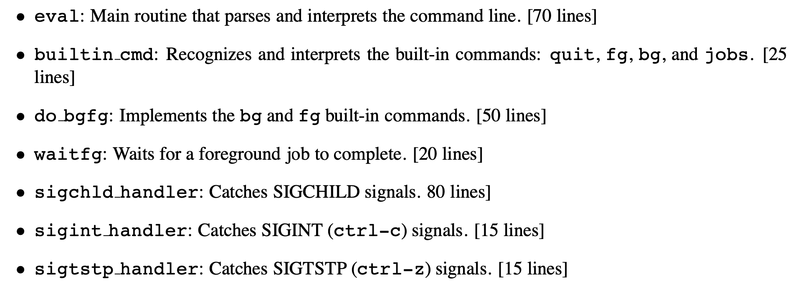
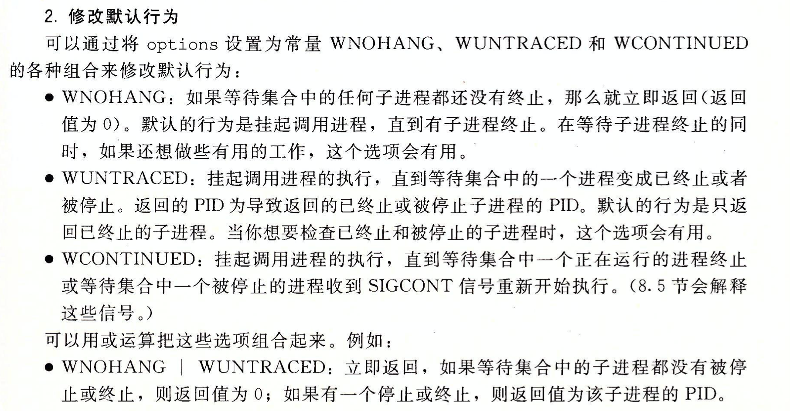
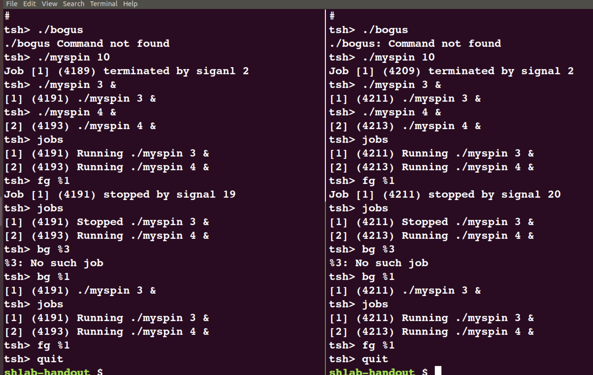

# ShellLab

首先要做的事情当然是仔细阅读`writeup`文件:

该实验要求在提供的`tsh.c`代码框架下，实现一个能支持作业调度、进程信号控制以及前后台作业切换的`tiny shell——tsh`。其中要求实现的函数包括：



根据阅读书本上提供的shell例程，我们可以知道最简单的shell是由以下几部分组成:

```c
int main(int argc, char *argv[]);
void eval(char *cmdlind);
int parseline(char *buf, char *argv[]);
int builtin_command(char *argv[]);
```

一个C程序的入口永远是`<main>`函数，所以考虑从阅读`<main>`函数入手：

## main
```c
/*
 * main - The shell's main routine 
 */
int main(int argc, char **argv) 
{
    char c;
    char cmdline[MAXLINE];
    int emit_prompt = 1; /* emit prompt (default) */

    /* Redirect stderr to stdout (so that driver will get all output
     * on the pipe connected to stdout) */
    dup2(1, 2);

    /* Parse the command line */
    while ((c = getopt(argc, argv, "hvp")) != EOF) {
        switch (c) {
        case 'h':             /* print help message */
            usage();
	    break;
        case 'v':             /* emit additional diagnostic info */
            verbose = 1;
	    break;
        case 'p':             /* don't print a prompt */
            emit_prompt = 0;  /* handy for automatic testing */
	    break;
	default:
            usage();
	}
    }

    /* Install the signal handlers */

    /* These are the ones you will need to implement */
    Signal(SIGINT,  sigint_handler);   /* ctrl-c */
    Signal(SIGTSTP, sigtstp_handler);  /* ctrl-z */
    Signal(SIGCHLD, sigchld_handler);  /* Terminated or stopped child */

    /* This one provides a clean way to kill the shell */
    Signal(SIGQUIT, sigquit_handler); 

    /* Initialize the job list */
    initjobs(jobs);

    /* Execute the shell's read/eval loop */
    while (1) {

	/* Read command line */
	if (emit_prompt) {
	    printf("%s", prompt);
	    fflush(stdout);
	}
	if ((fgets(cmdline, MAXLINE, stdin) == NULL) && ferror(stdin))
	    app_error("fgets error");
	if (feof(stdin)) { /* End of file (ctrl-d) */
	    fflush(stdout);
	    exit(0);
	}

	/* Evaluate the command line */
	eval(cmdline);
	fflush(stdout);
	fflush(stdout);
    } 

    exit(0); /* control never reaches here */
}
```
`<main>`在定义了一系列变量之后进入了一个`while`循环，在循环中调用了`<getopt>`函数，这个函数可以对执行程序时输入的参数进行选择处理。

随后即install了三个信号处理程序:
```c
Signal(SIGINT,  sigint_handler);   /* ctrl-c */
Signal(SIGTSTP, sigtstp_handler);  /* ctrl-z */
Signal(SIGCHLD, sigchld_handler);  /* Terminated or stopped child */
```
这也正是我们需要实现的函数，继续往后读。在初始化任务列表`<initjobs>`后便正式进入了我们的shell循环:

不停地从标准输入`stdin`中按行读取字符串存储到`cmdline`中，并将`cmdline`作为参数传递给`<eval>`函数进行解析执行。

我们现在可以考虑开始编写我们需要实现的函数了，由于`<eval>`比较复杂，而信号处理程序的实现较为简单，所以我们考虑首先来完成三个信号处理程序。


## sig*_handler

### sigint_handler
> sigint_handler - The kernel sends a SIGINT to the shell whenver the user types ctrl-c at the keyboard.  Catch it and send it along to the foreground job.  

代码实现如下:
```c
void sigint_handler(int sig)
{
	int olderrno = errno;
	pid_t pid;
	sigset_t mask_all, prev_mask;
	sigfillset(&mask_all);
	sigprocmask(SIG_BLOCK, &mask_all, &prev_mask);
	if((pid = fgpid(jobs)) != 0){
		sigprocmask(SIG_SETMASK, &prev_mask, NULL);
		kill(-pid, SIGINT);
	}
	errno = olderrno;
  return;
}
```


### sigtstp_handler
> sigtstp_handler - The kernel sends a SIGTSTP to the shell whenever the user types ctrl-z at the keyboard. Catch it and suspend the foreground job by sending it a SIGTSTP.  

代码实现如下:
```c
void sigtstp_handler(int sig) 
{
	int olderrno = errno;
	pid_t pid;
	sigset_t mask_all, prev_mask;
	sigfillset(&mask_all);
	sigprocmask(SIG_BLOCK, &mask_all, &prev_mask);
	if((pid = fgpid(jobs)) != 0){
		sigprocmask(SIG_SETMASK, &prev_mask, NULL);
		kill(-pid, SIGSTOP);
	}
	errno = olderrno;
    return;
```


### sigchld_handler
> sigchld_handler - The kernel sends a SIGCHLD to the shell whenever a child job terminates (becomes a zombie), or stops because it received a SIGSTOP or SIGTSTP signal. The handler reaps all available zombie children, but doesn't wait for any other currently running children to terminate.  

即当任何一个子作业收到一个`SIGSTOP`或`SIGTSTP`信号终止时，该处理程序会捕获内核发出的`SIGCHLD`信号，回收所有的僵死子作业，但是并不等待当前正在运行的子作业终止，这里刚好就要用到书上提到的一个`option`选项:



代码实现如下:

```c
void sigchld_handler(int sig) 
{
	int olderrno = errno;
	int status;
	pid_t pid;
	struct job_t *job;
	sigset_t mask_all, prev_mask;
	Sigfillset(&mask_all);
	while((pid = waitpid(-1, &status, WNOHANG | WUNTRACED)) > 0){
		Sigprocmask(SIG_BLOCK, &mask_all, &prev_mask);
		if(WIFEXITED(status))	/* terminated normally */
			deletejob(jobs, pid);
		else if(WIFSIGNALED(status)){
			printf("Job [%d] (%d) terminated by signal %d\n", pid2jid(pid), pid, WTERMSIG(status));
			deletejob(jobs, pid);
		}
		else if(WIFSTOPPED(status)){
			printf("Job [%d] (%d) stopped by signal %d\n", pid2jid(pid), pid, WSTOPSIG(status));
			job = getjobpid(jobs, pid);
			job->state = ST;
		}
		Sigprocmask(SIG_SETMASK, &prev_mask, NULL);
	}
	errno = olderrno; 
    return;
}
```


## eval

`<eval>`的实现其实比较简单，因为书上已经给了我们一个"less interesting"的版本，我们需要做的就是在这个版本上进行修改即可。

代码实现如下:

```c
void eval(char *cmdline) 
{
	char *argv[MAXARGS];	/* Arguments list execve() */
	char buf[MAXLINE];		/* Holds modified command line*/
	int bg;					/* Should the job run in bg or fg ? */
	pid_t pid;				/* Process id */

	strcpy(buf, cmdline);
	bg = parseline(buf, argv);
	if(argv[0] == NULL)
		return;		/* Ignore empty lines */
	
	sigset_t mask_all, mask_chld, prev_mask;
	sigfillset(&mask_all);
	sigemptyset(&mask_chld);
	sigaddset(&mask_chld, SIGCHLD);

	if(!builtin_cmd(argv)){
		sigprocmask(SIG_BLOCK, &mask_chld, &prev_mask);
		if((pid = fork()) == 0){	/* Child runs user job */
			sigprocmask(SIG_SETMASK, &prev_mask, NULL);
			setpgid(0, 0);
			if(execve(argv[0], argv, environ) < 0){
				sigprocmask(SIG_BLOCK, &mask_chld, NULL);
				printf("%s Command not found\n", argv[0]);
				exit(0);
			}
		}

		/* Parent waits for foreground job to terminate */
		if(!bg){
			sigprocmask(SIG_BLOCK, &mask_all, NULL);
			addjob(jobs, pid, FG, cmdline);
			sigprocmask(SIG_SETMASK, &mask_chld, NULL);
			waitfg(pid);
		}
		else{
			sigprocmask(SIG_BLOCK, &mask_all, NULL);
			addjob(jobs, pid, BG, cmdline);
			sigprocmask(SIG_SETMASK, &mask_chld, NULL);
			printf("[%d] (%d) %s", pid2jid(pid), pid, cmdline);
		}
		sigprocmask(SIG_SETMASK, &prev_mask, NULL);
	}
	return;
}

```

需要注意的是，根据书上的说法:

所以我们需要在每次调用`printf`前进行信号屏蔽，否则会出错。

## builtin_cmd

这部分代码也很简单，根据在`eval`中得到的命令，去判断一下`argv[0]`是否是一个内置命令，如果是就执行相应的操作，否则返回0表明这不是一个内置命令。

代码实现如下:

```c
int builtin_cmd(char **argv) 
{
	if(!strcmp(argv[0], "quit"))
		exit(0);
	if(!strcmp(argv[0], "&"))
		return 1;

	if(!strcmp(argv[0], "jobs")){
		listjobs(jobs);
		return 1;
	}
	if(!strcmp(argv[0], "bg") || !strcmp(argv[0], "fg")){
		do_bgfg(argv);
		return 1;
	}
    return 0;     /* not a builtin command */
}

```


## do_bgfg

首先明确两个命令的输入格式:

```bash
bg <job>
fg <job>
```
两个命令分别从后台和前台调动对应`<job>`号的作业继续执行，实现思路如下:

- 根据`argv[0]`设置将要调用的作业状态等于`FG`或`BG`；
- 读取`argv[1]`获得对应的`jobid`或`pid`；
- 向其发送`SIGCONT`信号，如果是`FG`，就`waitfg`；否则直接打印要求输出的信息。

代码实现如下:
```c
void do_bgfg(char **argv) 
{
    struct job_t *job = NULL;        
    int state;                     
    int id;                        
    if(!strcmp(argv[0], "bg")) state = BG;
        else state = FG;  
    if(argv[1]==NULL){               
        printf("%s command requires PID or %%jobid argument\n", argv[0]);
        return;
    }
    if(argv[1][0]=='%'){             
       if(sscanf(&argv[1][1], "%d", &id) > 0){
            job = getjobjid(jobs, id);  
            if(job==NULL){
                printf("%%%d: No such job\n", id);
                return;
            }
        }
    }
    else if(!isdigit(argv[1][0])) {  
        printf("%s: argument must be a PID or %%jobid\n", argv[0]);
        return;
    }
    else{                      
        id = atoi(argv[1]);
        job = getjobpid(jobs, id);
        if(job==NULL){
            printf("(%d): No such process\n", id);
            return;
        }

    }
    kill(-(job->pid), SIGCONT);       
    job->state = state;
    if(state == BG)
        printf("[%d] (%d) %s",job->jid, job->pid, job->cmdline);
    else 
        waitfg(job->pid);
    return;
}
```

## waitfg

> waitfg - Block until process pid is no longer the foreground process

作者贴心地为我们准备了这个函数：

```c
/* fgpid - Return PID of current foreground job, 0 if no such job */
pid_t fgpid(struct job_t *jobs) {
    int i;

    for (i = 0; i < MAXJOBS; i++)
	if (jobs[i].state == FG)
	    return jobs[i].pid;
    return 0;
}
```

所以只需要不停地调用`fgpid`测试返回值，并挂起当前进程(注意要设置此时能够接受到进程终止的信号)，等待信号带来即可。

代码实现如下:

```c
void waitfg(pid_t pid)
{
	sigset_t mask_all;
	sigemptyset(&mask_all);
	while(fgpid(jobs) != 0){
		sigsuspend(&mask_all);
	}
    return;
}

```

此处我们按照教材建议使用`sigsespend`。


## ---Answer Test---



左侧运行`make test15`，右侧运行`make rtest15`，`ShellLab`顺利通过。


